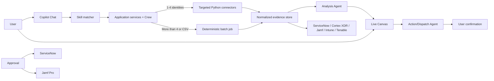

# Fleet Recon

Fleet Recon is a planned collaborative endpoint telemetry and remediation platform for enterprise IT operations. It replaces one-off HTML reports, spreadsheets, and disconnected console lookups with a shared workspace for investigating endpoint discrepancies, coordinating cleanup, and dispatching explicitly approved actions.

The project is currently in the **Define** phase. Product requirements are available in [project-context/1.define](project-context/1.define); application code and a runnable service have not been scaffolded yet.

## Problem

A single endpoint can appear in several systems, each with a different and incomplete version of its state:

- ServiceNow records ownership, lifecycle, CMDB relationships, and ticket history.
- Cortex XDR supplies active endpoint-security telemetry and investigation evidence.
- Jamf Pro manages Apple-device inventory, policy, and management state.
- Microsoft Intune reports device-management and compliance state.
- Tenable supplies vulnerability, exposure, and scan information.

Teams must reconcile these sources manually, typically by exporting reports, moving across browser tabs, and coordinating decisions through spreadsheets and chat. That creates stale results, duplicated work, weak CMDB closure tracking, and a poor audit trail for remediation.

## Value Proposition

Fleet Recon is the shared reconciliation and decision layer between the systems teams already use. It combines source-cited endpoint evidence with real-time collaboration, then converts selected work into approval-governed remediation.

It is not intended to replace a CMDB, MDM, EDR, vulnerability-management, or ITSM platform. It makes their combined operational data usable for a specific job: determining what is true about an endpoint, who owns the next step, and what was safely done about it.

## Key Features

### Evidence Reconciliation

- Collect and normalize read-only evidence from ServiceNow, Cortex XDR, Jamf Pro, Microsoft Intune, and Tenable.
- Preserve provenance for every result: source, source record, retrieval time, correlation ID, status, and confidence.
- Surface disagreements such as stale CMDB records, missing MDM enrollment, ownership mismatch, non-compliance, or vulnerability exposure.

### Dual-Engine Execution

- **Micro-query mode:** requests containing 1-4 normalized identities use targeted connector calls and stream compact chat summaries plus a CSV artifact card.
- **Batch automation mode:** requests with more than 4 identities, or any CSV upload, become sanitized internal CSV payloads processed by deterministic, parallel Python jobs (the packaged Claude Code scripts).
- Route choice is made after skill binding, validation, and deduplication, persisted with the query run, and never silently changes mid-run. Identity lists are not sent to the LLM on either route.

### Copilot Chat and Live Canvas

- A conversational left pane accepts workflow skill requests, pasted usernames, CSV uploads, connector actions, progress updates, Slack-style CSV result cards, and approval prompts.
- A shared right-side canvas shows user/device evidence, filters, findings, notes, assignments, check state, CMDB cleanup state, activity history, and CSV export.
- Canvas mutations are server-authoritative, versioned, and broadcast to collaborators.

### Governed AI Agents

- Evidence-backed recommendations use structured outputs and source-evidence citations.
- The system labels incomplete or conflicting evidence instead of making unsupported conclusions.
- State-changing actions are previewed, scoped, allowlisted, and require an explicit approval record.

### Initial Approved Dispatches

- Create ServiceNow tickets from selected work items.
- Trigger allowlisted Jamf policies.
- Record requester, confirmation status, target set, expiration, idempotency key, execution receipt, and audit events.

## Planned Application Architecture



### Agent Roles

| Agent | Responsibility | Hard Boundary |
| --- | --- | --- |
| Orchestrator Agent | Coordinate a skill-bound run, report status, and create approval requests. Does not extract names or choose connectors. | Does not execute state-changing connector operations or put identity lists in model context. |
| Analysis Agent | Compare normalized evidence and produce cited findings with confidence and playbooks. | Does not mutate systems or infer unsupported facts. |
| Action/Dispatch Agent | Turn selected, approved work into an allowlisted ServiceNow or Jamf operation. | Cannot bypass approval, change scope, or invoke an unallowlisted action. |

The implementation target is **Python** with a **CrewAI** runtime. The System Architecture Document will select the web framework, persistence, eventing, queue, authentication, and deployment components.

## Getting Started

### Current State

There is no runnable application yet. Begin with the product and architecture artifacts rather than attempting to start a server.

### Prerequisites

- Python 3.11 or later
- Git
- Access to approved non-production credentials for the planned integrations when the integration phase begins
- Optional: the AAMAD CLI for artifact quality checks

### Review the Product Definition

```bash
git clone <repository-url>
cd fleet-recon
```

Read the Define-phase artifacts:

- [Market Requirements Document](project-context/1.define/mrd.md)
- [Product Requirements Document](project-context/1.define/prd.md)
- [Phase 1 Execution Plan](project-context/1.define/phase-1-execution-plan.md)

To validate AAMAD artifacts after the architecture deliverable exists:

```bash
aamad validate
```

At present, the validation gate is expected to report that `project-context/1.define/sad.md` is missing. That is the next architecture-owned artifact, not an application failure.

### Future Runtime Setup

After the System Architect and Project Manager complete their phases, this section will document the approved dependency installation, environment templates, migration commands, local service startup, test commands, and connector sandbox configuration. Never add API secrets to the repository; use the future `.env.example` as a names-only reference.

## Project Structure

```text
fleet-recon/
├── .github/
│   ├── agents/                  # VS Code Copilot AAMAD personas
│   ├── instructions/            # Shared AAMAD workflow instructions
│   └── prompts/                 # Phase and documentation prompts
├── .cursor/                     # Cursor-compatible AAMAD artifacts
├── project-context/
│   ├── 1.define/                # MRD, PRD, SAD/SFS, user stories, backlog
│   ├── 2.build/                 # Setup, implementation, QA, security artifacts
│   └── 3.deliver/               # Deployment runbook and user guide
├── aamad.config.yml             # Runtime, quality, security, and documentation policy
├── AGENTS.md                    # Persona and delivery-flow overview
├── CHECKLIST.md                 # AAMAD quality checklist
└── README.md                    # Project entry point
```

Planned source directories, tests, dependency manifests, and environment templates will be added only after architecture and setup decisions are approved.

## Delivery Workflow

Fleet Recon uses the AAMAD Define -> Build -> Deliver workflow:

1. **Define:** Product Manager produces the MRD, PRD, and user stories; System Architect follows with the SAD and System Functional Specification.
2. **Build:** Project Manager establishes the approved skeleton; frontend, backend, integration, QA, and security personas deliver and validate scoped artifacts.
3. **Deliver:** DevOps packages the validated system, deployment guidance, and user documentation.

The repository configuration requires unit tests, integration tests, dependency audit, and security assessment before delivery.

## Next Steps for Contributors

1. Create `project-context/1.define/sad.md` and the System Functional Specification from the PRD. Resolve the persistence, real-time collaboration, queue, authentication, and connector-contract choices.
2. Convert the execution plan into traceable MVP user stories under `project-context/1.define/user-stories/`.
3. Establish the application skeleton, approved dependencies, `.env.example`, and local development instructions after architecture approval.
4. Build the routing and evidence model before connector breadth or agent dispatch.
5. Implement read-only connector contracts with sandbox fixtures and partial-failure behavior.
6. Build the collaborative canvas and agent analysis against persisted, source-cited evidence.
7. Add the approval boundary before any ServiceNow ticket or Jamf policy action.
8. Complete unit, integration, security, and delivery gates before a controlled pilot.

## Contributing Principles

- Keep every result traceable to source evidence and retrieval time.
- Treat LLM output as a recommendation, not as authority to mutate enterprise systems.
- Never embed credentials, tokens, or customer endpoint data in source, prompts, exports, or test fixtures.
- Keep connector failures isolated; preserve successful evidence from other sources.
- Prefer deterministic jobs for batch processing and bound all connector calls by rate limits and idempotency safeguards.
- Document product, architecture, and implementation decisions in `project-context/` as work progresses.

## Documentation

- [MRD](project-context/1.define/mrd.md)
- [PRD](project-context/1.define/prd.md)
- [Phase 1 Execution Plan](project-context/1.define/phase-1-execution-plan.md)
- [Agent Framework Overview](AGENTS.md)

## License

License terms have not yet been defined for this project.
