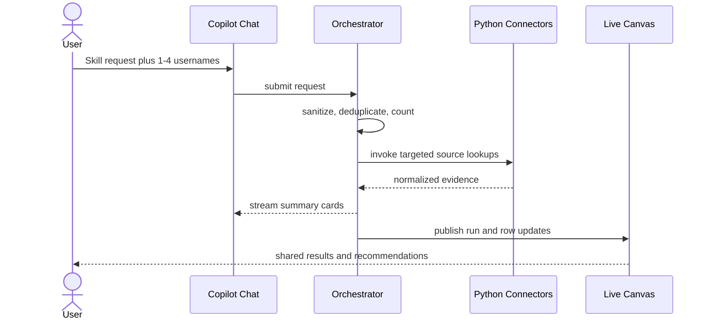
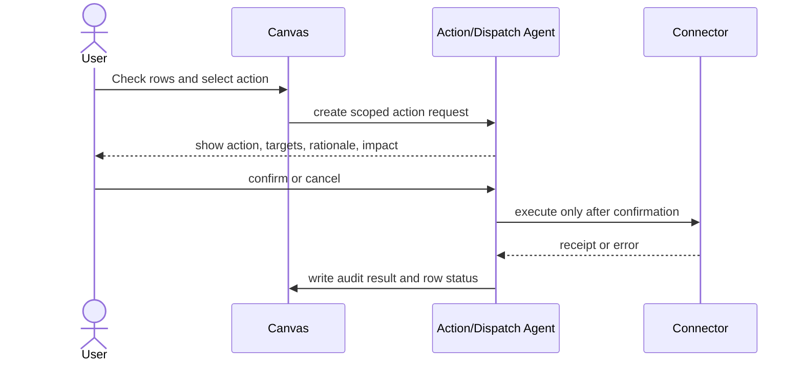

# Fleet Recon Product Requirements Document

## 1. Purpose

This PRD defines the MVP of Fleet Recon: a prebaked chat workspace that packages the operator’s Claude Code skills and workflows so non-developers can run them against org systems without using a CLI. The first skill is endpoint device lookup. The workspace collects telemetry from ServiceNow, Cortex XDR, Jamf Pro, Microsoft Intune, and Tenable; displays normalized evidence in chat (including a Slack-style CSV preview) and on a live canvas; and drives approved remediation actions.

## 2. Users and Permissions

The MVP has two permission roles:

- **Workspace User:** can run queries, trigger tools authorized for the current workspace during a query, view and export permitted results, update shared canvas state, add notes, assign work, and request or confirm a scoped remediation action. A Workspace User cannot view, edit, or configure tool definitions, tool parameters, tool assignments, credentials, or connection diagnostics.
- **Administrator:** can perform all Workspace User activities and manage the tool catalog, workspace tool enablement, agent assignments, validated tool parameters, service credentials, connection tests, and action allowlists for authorized workspaces. Administrator access must be granted through the enterprise identity provider and checked server-side on every configuration request.

Tool execution is always limited by the intersection of the tool's global definition, workspace enablement, agent assignment, user authorization, parameter schema, and any action allowlist. A user may invoke an authorized tool through a query without receiving access to its implementation, credentials, or hidden configuration. All configuration and credential mutations must capture the authenticated actor, workspace, timestamp, entity version, and correlation ID.

## 3. MVP Experience

### 3.1 Application Layout

The desktop-first application has two independently scrollable panels:

- **Copilot Chat, left:** a prebaked skill window. Empty state lists enabled skills (for example **Look up users' devices**) as chips. The composer accepts natural-language requests, pasted usernames, and CSV uploads. The server binds the message to a registered skill, extracts identities separately from instruction prose, and renders run status, errors, action-confirmation prompts, and Slack-style result-file cards (CSV preview, copy, download). A `+` menu exposes CSV upload and permitted integration actions; connector configuration is restricted to the designated administrator. Workspace Users never see SKILL.md, scripts, or credentials.
- **Administrator Settings:** visible only to Administrators; provides Tool Management and Credential Management views with workspace scope, save/test status, validation errors, and audit-safe activity history. Secret values are write-only after initial submission and are never rendered in the browser.
- **Live Canvas Dashboard, right:** displays shared filter controls, a user table, a device/evidence table or drill-down, assignment and note state, CMDB cleanup status, run activity, and CSV export.

The dashboard must remain useful without the chat pane: it renders persisted results and lets authorized users update work state. Chat commands and canvas actions must refer to the same server-side entities.

### 3.2 Primary User Flows

#### Configure Tools and Credentials (Administrator)

1. An Administrator opens Settings and selects a workspace.
2. Tool Management lists every registered Python tool, including display name, purpose, version, source integration, assigned agents, workspace state, and last validation time. The examples `asset_report_build.py`, `asset_report_mdm.py`, and `asset_report_app.py` are represented as registered capabilities rather than arbitrary executable file paths.
3. The Administrator enables or disables a tool for that workspace, assigns it to one or more permitted agents, and edits only parameters exposed by the tool's typed schema, such as ServiceNow state filters or platform allowlists.
4. The UI validates parameter types, allowed values, required fields, and safe bounds before save; it shows a proposed configuration diff and requires confirmation for changes that affect execution scope.
5. The Administrator opens Credential Management, selects an integration, enters or rotates its API credentials, and saves. The service validates the credential format, stores it in the approved secret manager, and does not persist plaintext in application data.
6. The Administrator runs a connection test or observes the scheduled health result. The UI displays the current diagnostic state, timestamp, latency when available, and a redacted actionable error; it never displays a token, secret, or authorization header.

Configuration changes apply only to new runs unless an active run explicitly supports a versioned configuration snapshot. Existing runs retain the tool and parameter versions used at start time.

#### Investigate a Small Set

#### Process a Batch

#### Request and Execute Remediation

## 4. Functional Requirements

### FR-1: Request Intake and Validation

- The system accepts typed requests, pasted usernames, and CSV uploads. Instruction prose (for example "look up these users devices") is classified as skill intent and is not counted as an identity.
- Sanitization trims whitespace, strips unsupported control characters, normalizes line endings, extracts allowed username values, removes duplicates, and reports rejected input without exposing sensitive raw content in logs.
- CSV uploads must enforce a configurable file-size and row-count limit, allowed MIME/type policy, required username column mapping, encoding handling, and malware scanning if the enterprise upload service requires it.
- Every accepted request creates a query run with a UUID, initiator, bound `skill_id`, input type, sanitized identity count, routing decision, status, and correlation ID.

### FR-2: Dual-Engine Routing

| Condition | Required Route | Behavior |
| --- | --- | --- |
| 1-4 unique identities and no CSV upload | Micro-query | Bound skill selects registered Python connector methods. Each identity is looked up concurrently (not by an LLM looping tools). Stream compact chat cards and persist equivalent evidence to the canvas. Names are not placed in model context. |
| More than 4 unique identities | Batch automation | Create internal sanitized username CSV, enqueue the skill’s deterministic Python job (the Claude Code scripts behind registered tools), publish progress, and return aggregated results. Names are not placed in model context. |
| Any CSV upload | Batch automation | Validate and transform upload to internal CSV payload before job enqueue. |
| Invalid or empty normalized identities | Reject | Explain validation error and do not call connectors or agents. |

Routing is evaluated after skill binding, sanitization, and deduplication. The constant is `MICRO_QUERY_MAX_SUBJECTS = 4`. The decision must be stored and testable. A request never changes route mid-run; a retry creates a new run referencing the original run. Skill binding selects which connectors run; routing only selects micro-query vs batch execution of that skill.

### FR-3: Connector Collection

- Each registered skill declares its connector set. The MVP skill **Look up users' devices** (`lookup-user-devices`) always uses ServiceNow, Jamf Pro, and Microsoft Intune together; it does not call Cortex XDR, Tenable, or `asset_report_app`.
- ServiceNow supplies CMDB record, assignment/owner, lifecycle, and ticket context.
- Cortex XDR supplies active endpoint telemetry and operating-system classification (available to skills that declare it; not part of `lookup-user-devices`).
- Jamf Pro supplies macOS enrollment, MDM compliance, and permitted policy state.
- Microsoft Intune supplies Windows enrollment, MDM compliance, and management state.
- Tenable supplies vulnerability/compliance scan findings and last-seen status (available to skills that declare it; not part of `lookup-user-devices`).
- Connector adapters implement a shared Python contract: `validate_connection`, `fetch_by_identity`, `normalize`, `rate_limit`, `retry_safe`, and `redact_for_model`.
- Each response preserves source system, source record ID, retrieval timestamp, request correlation ID, status, raw-response retention reference, and normalized payload version.
- Individual connector failures must not invalidate evidence from other sources. The run reports partial completion and error detail appropriate to the user's role.

### FR-4: Analysis and Recommendations

- The Analysis Agent receives normalized, least-privilege JSON only. It may not receive credentials or unredacted raw payloads unless an approved policy explicitly permits a field.
- It identifies evidence conflicts and assigns a finding category and confidence: `cmdb_gap`, `unmanaged_device`, `stale_telemetry`, `ownership_mismatch`, `non_compliance`, `vulnerability_exposure`, or `insufficient_evidence`.
- It returns a structured playbook containing cited evidence IDs, explanation, confidence, recommended action, prerequisites, and whether approval is required.
- Low-confidence or incomplete findings must be labeled as such and may not automatically produce dispatchable remediation.

### FR-5: Live Canvas Collaboration

- Users can filter by run, owner, platform, connector state, finding category, compliance, assignment, and CMDB cleanup state.
- Authorized users can change a row's checked state, add/edit notes, assign a work item, select CMDB cleanup status, and create an action request.
- Updates are server-authoritative and broadcast to active collaborators within five seconds.
- Concurrent edits must use optimistic concurrency/version checks. On conflict, the client presents the current state and preserves unsaved note text for resolution.
- An append-only activity stream records state transitions, actor, timestamp, prior/new values, and originating run/action.
- CSV export honors active filters and includes export generation time and data-source timestamps.

### FR-6: Confirmation-Gated Actions

- Action/Dispatch Agent converts selected canvas work items into a previewable action request, never a direct connector mutation.
- An action request must list targets, connector, operation, requested parameters, evidence rationale, blast-radius count, requester, confirmation status, expiration, and idempotency key.
- Heavy MDM scans and all state-changing operations require explicit user confirmation. Confirmation UI appears in chat and is reflected on the canvas.
- Jamf policies and ServiceNow ticket creation are the only action integrations in MVP, controlled by an administrator-maintained allowlist.
- Cancellations, expirations, execution receipts, and failures are durable audit events. Retrying a failed action requires a new confirmed request.

### FR-7: Administrator Tool Management and Extensibility

- The system maintains a versioned registry of approved Python tools/scripts. Each registry entry includes a stable tool ID, display name, purpose, owning integration, version, implementation reference, input/output schema, permitted agents, read-only or state-changing classification, and lifecycle status.
- The initial registry must support the capabilities represented by `asset_report_build.py`, `asset_report_mdm.py`, and `asset_report_app.py` without exposing arbitrary filesystem execution or allowing an administrator to upload unreviewed code through the product UI. These map from Claude Code `/.claude/skills/asset-ops/scripts` at packaging time into `ToolDefinition` records; runtime execution uses the registry, not a live SKILL.md read.
- An Administrator can view all registered tools, enable or disable each tool per workspace, and assign each enabled tool to one or more agents. Disabled tools and tools not assigned to the invoking agent cannot be selected or executed.
- Tool assignment and enablement are workspace-scoped, versioned, auditable, and server-enforced. The UI must show effective status, assignment, version, and last validation result.
- An Administrator can edit only schema-declared configuration parameters. The UI must support typed values, defaults, descriptions, allowed values, safe bounds, and sensitive-parameter markers; examples include ServiceNow state filters and platform allowlists.
- Saving configuration validates the complete parameter set, displays validation errors inline, records a configuration version, and applies it to new runs. Each run stores an immutable snapshot of effective tool versions and parameters.
- A Workspace User can trigger an enabled and assigned tool through an eligible query, but cannot discover hidden parameters, read implementation details, or override administrator configuration and authorization boundaries.

### FR-8: Administrator Credential Vault

- Credential Management must provide an Administrator-only entry and rotation flow for ServiceNow, Jamf Pro, Microsoft Intune, Cortex XDR, and Tenable.
- Each integration supports the credential fields required by its connector contract, validation of required format, replace/rotate, deactivate, and revocation status. The UI must identify the integration and credential alias without displaying stored secret values.
- Credentials are stored only through the approved secret manager, referenced by an opaque secret ID, and excluded from logs, agent context, browser responses, exports, and general application database records.
- Credential updates use optimistic concurrency, show the last successful update actor/time and current lifecycle state, and require re-authentication or equivalent step-up authentication when enterprise policy requires it.
- A credential may be saved without being activated until its connection test succeeds, unless an Administrator explicitly confirms activation after a diagnostic failure. Existing runs use their recorded credential/configuration snapshot; new runs use the active credential version.

### FR-9: Connection Health and Diagnostics

- Credential Management displays one health row per supported integration with current state, checked-at time, credential version, response latency when available, and a redacted diagnostic message.
- The minimum states are `Not Configured`, `Connected`, `Authentication Failed`, `Rate Limited`, `Unavailable`, `Configuration Invalid`, and `Unknown`.
- Administrators can run an on-demand least-privilege connection test and the system must also support scheduled health checks. A test must identify the integration and credential version used, never execute a state-changing operation, and persist its result with a correlation ID.
- Diagnostic transitions are visible to Administrators and recorded as audit events. Workspace Users may see only a generic integration availability signal needed to explain a query failure and must not see credential details or unrestricted diagnostic payloads.
- A failed health check must not silently enable a tool or cause retries that exceed the connector's rate limit. Query routing must surface unavailable integrations as partial or blocked according to the tool's declared dependency policy.

### FR-10: Chat Result Artifacts

- When a skill produces tabular results, chat must render a Slack-style file card in the thread: filename, media type, row count, header row, a capped preview of data rows, a truncation label when more rows exist, Copy CSV, Copy for spreadsheet (tab-separated), and Download.
- The downloadable CSV is a server-persisted `ResultArtifact` for the run. Preview rows are a bounded subset of that artifact, never a second LLM-written table.
- Copy and download must be usable in Excel or Google Sheets without opening the canvas. The canvas continues to show the same rows for collaboration.
- Artifacts exclude secrets, authorization headers, and unredacted raw vendor payloads.

## 5. Data and State Model

| Entity | Required Fields | Notes |
| --- | --- | --- |
| Workspace | `id`, `tenant_id`, `name` | Collaboration boundary. |
| QueryRun | `id`, `workspace_id`, `initiator_id`, `skill_id`, `input_kind`, `input_count`, `mode`, `status`, `correlation_id`, timestamps | Immutable input metadata; status progresses queued/running/partial/completed/failed/cancelled. |
| Subject | `id`, `workspace_id`, `username`, `display_name`, `identity_confidence` | Canonical person identity. |
| Device | `id`, `subject_id`, `serial`, `hostname`, `os_family`, `canonical_status` | May link to multiple source IDs. |
| SourceEvidence | `id`, `device_id`, `query_run_id`, `source`, `source_record_id`, `retrieved_at`, `status`, `normalized_json_ref`, `schema_version` | Source-of-truth evidence and provenance. |
| Finding | `id`, `device_id`, `category`, `severity`, `confidence`, `evidence_ids`, `recommendation`, `state` | Agent result is structured and revisable. |
| CanvasWorkItem | `id`, `device_id`, `finding_id`, `checked`, `assignee_id`, `cmdb_cleanup_state`, `version` | Shared mutable canvas state. |
| Note | `id`, `work_item_id`, `author_id`, `body`, timestamps, `version` | Revisioned user commentary. |
| ActionRequest | `id`, `work_item_ids`, `operation`, `connector`, `parameters`, `status`, `requester_id`, `confirmed_at`, `idempotency_key`, timestamps | Confirmation and execution boundary. |
| WorkflowDefinition | `id`, `name`, `trigger_phrases`, `tool_ids`, `output_artifact`, `lifecycle_state` | Packaged Claude Code skill/workflow; tools are registered capabilities, not SKILL.md at runtime. |
| ToolDefinition | `id`, `name`, `version`, `integration`, `implementation_ref`, `input_schema`, `output_schema`, `agent_allowlist`, `mutability`, `lifecycle_state` | Approved Python capability registry; implementation reference is not executable user input. |
| ResultArtifact | `id`, `query_run_id`, `filename`, `media_type`, `row_count`, `object_ref`, `preview_json`, timestamps | Chat/canvas CSV (or other file) produced by a run; preview is a bounded row subset. |
| WorkspaceToolConfig | `id`, `workspace_id`, `tool_id`, `enabled`, `assigned_agents`, `parameters_json`, `version`, `updated_by`, timestamps | Workspace-scoped enablement, assignment, and validated parameters. |
| CredentialReference | `id`, `workspace_id`, `integration`, `secret_manager_ref`, `version`, `state`, `updated_by`, timestamps | Opaque reference and lifecycle metadata only; no plaintext secret. |
| ConnectionHealthCheck | `id`, `workspace_id`, `integration`, `credential_version`, `state`, `latency_ms`, `redacted_message`, `correlation_id`, `checked_at` | Diagnostic history and current integration health. |
| AuditEvent | `id`, `entity_type`, `entity_id`, `actor_id`, `event_type`, `before_json`, `after_json`, `correlation_id`, timestamp | Append-only event history. |

`cmdb_cleanup_state` values: `not_needed`, `needs_review`, `ticket_requested`, `in_progress`, `resolved`, `not_actionable`.

## 6. AI Agent Specifications

### Orchestrator Agent

**Purpose:** coordinate a run that a deterministic skill matcher and router have already bound. The Orchestrator does not extract names, choose connectors, or loop tools per identity.

**Permitted tools:** query-run store; read-only connector dispatcher; deterministic batch-job enqueuer; canvas event publisher; action-request creator.

**Prohibited tools/actions:** direct state-changing connector calls; secrets access; confirmation inference; raw payload export; receiving unsanitized name lists or raw chat text in model context.

**Prompt contract:** "Use only validated request metadata (`skill_id`, `mode`, `input_count`, correlation ID) and permitted normalized evidence references. Do not re-decide the route or invent connectors. For any heavy scan or mutation, create a confirmation request with scope and impact. Return structured status, correlation ID, and user-safe explanation."

### Analysis Agent

**Purpose:** correlate normalized evidence, identify discrepancies, and prepare evidence-backed playbooks.

**Permitted tools:** read-only normalized evidence retrieval; findings store; policy/rule catalog.

**Prohibited tools/actions:** connector mutation; ticket creation; MDM policy invocation; unsupported conclusions when evidence is absent.

**Prompt contract:** "Compare only provided evidence. Cite evidence IDs for every claim. Return a machine-valid finding category, confidence, explanation, and recommended next action. When evidence conflicts or is insufficient, say so and recommend verification rather than remediation."

### Action/Dispatch Agent

**Purpose:** translate confirmed, selected work items into administrator-allowlisted ServiceNow or Jamf operations and record the outcome.

**Permitted tools:** selected-work-item reader; action-request store; confirmation verifier; allowlisted ServiceNow ticket creator; allowlisted Jamf policy trigger; audit-event writer.

**Prohibited tools/actions:** bypassing confirmation, broadening target scope, unallowlisted operation execution, or direct mutation from model-generated parameters without schema validation.

**Prompt contract:** "Construct an action preview from selected work items. Validate schema, target set, allowlist, and unexpired confirmation before execution. Execute exactly the confirmed operation once using the idempotency key. Return per-target receipts and update the audit trail."

## 7. Non-Functional Requirements

- **Security:** secrets are stored in approved secret management only; browser/API responses are redacted as required by workspace policy; least-privilege credentials and audit logging are mandatory.
- **Performance:** micro-query chat feedback begins after the first available connector response; batch workload is parallelized within per-connector rate limits and reports progress without model polling loops. Identity lists are excluded from model context on both routes so token cost does not scale with paste size.
- **Reliability:** jobs are retryable at safe boundaries, connector calls use bounded retry/backoff, and idempotency protects state-changing operations.
- **Observability:** structured logs, metrics, traces, correlation IDs, connector health, job queue depth, routing counts, and action outcomes are required.
- **Configuration and secrets:** authorization checks are server-side and deny by default; tool definitions and workspace configurations are versioned; secret-manager access is least privilege; secrets and diagnostic payloads are redacted from logs, agent prompts, browser responses, exports, and audit event values.
- **Accessibility:** keyboard-accessible core table and action controls, status announcements, and contrast-compliant state indicators.
- **Testing:** unit tests cover sanitization, routing threshold, normalization, administrator configuration restrictions, confirmation checks, concurrency behavior, and CSV export; integration tests cover each connector contract plus the confirmed action path.

## 8. Prioritized Product User Stories and Acceptance Criteria

### P0: Protect Enterprise Access and Enable Core Administration

**US-1: Manage integration credentials**

As an Administrator, I want to enter, rotate, deactivate, and test credentials for each supported enterprise integration so that Fleet Recon can collect evidence without exposing secrets.

- **AC-1.1:** The Credential Management view is inaccessible to a Workspace User by both navigation and direct API request; the API returns a denial without revealing credential metadata beyond the permitted generic response.
- **AC-1.2:** An Administrator can save a credential for ServiceNow, Jamf Pro, Microsoft Intune, Cortex XDR, or Tenable, and the application stores only an opaque secret-manager reference.
- **AC-1.3:** The UI never renders an existing secret, and automated logs, agent inputs, exports, and audit values contain no secret or authorization header.
- **AC-1.4:** Rotation creates a new credential version, records actor/time, and does not change the credential snapshot of an existing run.

**US-2: Diagnose integration connectivity**

As an Administrator, I want live and on-demand connection health for each integration so that I can correct access problems before users run investigations.

- **AC-2.1:** Each supported integration displays one of the defined diagnostic states, checked-at time, and a redacted message.
- **AC-2.2:** A connection test is read-only, records the credential version and correlation ID, and distinguishes at least Connected, Authentication Failed, Rate Limited, and Unavailable.
- **AC-2.3:** A Workspace User receives only the generic availability information needed to understand a blocked or partial query.

**US-3: Enforce role boundaries**

As a security owner, I want tool and credential administration enforced separately from query execution so that standard users can use approved capabilities without controlling them.

- **AC-3.1:** A Workspace User can trigger an enabled, assigned tool during a query but cannot enable, disable, assign, parameterize, or inspect its hidden configuration.
- **AC-3.2:** Every tool, configuration, credential, and diagnostic mutation is denied unless the authenticated actor has the Administrator claim for the target workspace.
- **AC-3.3:** Every permitted mutation produces an append-only audit event with actor, workspace, version, timestamp, and correlation ID.

### P0: Packaged Skill for Non-Developers

**US-8: Look up users' devices from chat**

As a Workspace User, I want to ask "look up these users devices" and paste names so that ServiceNow, Jamf, and Intune evidence comes back as a spreadsheet-ready CSV in chat.

- **AC-8.1:** Instruction prose is not treated as usernames; 1–4 unique identities take micro-query; 5 or more, or any CSV, take batch.
- **AC-8.2:** Both routes invoke `asset_report_build` then `asset_report_mdm` only; they do not invoke `asset_report_app`, Cortex XDR, or Tenable.
- **AC-8.3:** Chat shows a Slack-style CSV card with preview, copy, and download; the canvas shows the same rows.
- **AC-8.4:** Prompt traces and agent context contain `skill_id` and counts, not the pasted name list.

### P1: Govern Tool Extensibility

**US-4: Control tools per workspace**

As an Administrator, I want to view the approved Python tool catalog and toggle tools per workspace so that each workspace exposes only the capabilities it needs.

- **AC-4.1:** The catalog lists tool name, purpose, integration, version, lifecycle state, assigned agents, workspace enabled state, and last validation result.
- **AC-4.2:** Disabling a tool prevents new invocations in that workspace; an active run remains governed by its immutable start-time snapshot and is not silently reconfigured.
- **AC-4.3:** The system represents `asset_report_build.py`, `asset_report_mdm.py`, and `asset_report_app.py` as approved registered capabilities and does not permit arbitrary path execution from the UI.

**US-5: Configure safe tool parameters**

As an Administrator, I want to adjust supported tool flags such as ServiceNow state filters and platform allowlists so that investigations match workspace policy.

- **AC-5.1:** The UI renders only typed, schema-declared parameters with defaults, allowed values, descriptions, and safe bounds.
- **AC-5.2:** Invalid, out-of-range, or unauthorized values cannot be saved or passed to an agent.
- **AC-5.3:** A saved configuration receives a version, shows the effective diff before confirmation, records an audit event, and applies to new runs only.

### P2: Improve User Visibility and Operations

**US-6: Use authorized tools in a query**

As a Workspace User, I want the system to select the tools authorized for my workspace and agent so that I can investigate endpoints without managing integration configuration.

- **AC-6.1:** Tool selection is constrained by workspace enablement, agent assignment, user authorization, dependency health, and the tool schema.
- **AC-6.2:** The query result identifies the capability used and its configuration version without exposing credentials or hidden implementation details.
- **AC-6.3:** A disabled, unassigned, unhealthy, or unauthorized dependency yields a safe explanation and follows the declared blocked/partial-result policy.

**US-7: Preserve configuration traceability**

As an auditor, I want each run and administrative change tied to exact versions so that results and access decisions can be reconstructed.

- **AC-7.1:** Every run persists effective tool versions, workspace configuration versions, credential versions, and correlation ID.
- **AC-7.2:** Audit history distinguishes tool enablement, assignment, parameter change, credential lifecycle change, and health-state transition.
- **AC-7.3:** Audit records redact secrets and support actor/time/workspace filtering for authorized administrators.

## 9. MVP Acceptance Criteria

1. A request with four unique valid identities and no CSV routes to micro-query; one with five routes to batch after normalization. Instruction words in "look up these users devices" are not identities.
2. A CSV upload routes to batch regardless of row count and produces an internal sanitized CSV reference. The user-facing download is the device result artifact, not the upload.
3. A partial connector failure yields visible partial results and source-specific errors without discarding successful evidence. The chat CSV still downloads with per-source error columns.
4. Two authorized users viewing the same workspace observe an assignment or check-state update within five seconds.
5. A stale row version cannot overwrite a newer server-side state without a conflict response.
6. The analysis result cites source-evidence IDs and labels insufficient evidence.
7. A Jamf policy or ServiceNow ticket operation cannot execute without a matching confirmed, unexpired action request and audit record.
8. An export reflects active filters and workspace data policy. A completed `lookup-user-devices` run also attaches a chat CSV artifact with a capped preview.
9. An Administrator can enable/disable and agent-assign a registered tool per workspace, while a Workspace User cannot perform those operations through UI or API.
10. An Administrator can save and rotate each supported integration credential through the secret manager; no plaintext secret appears in persisted application records, logs, agent context, browser responses, exports, or audit events.
11. The health dashboard distinguishes Connected, Authentication Failed, Rate Limited, and Unavailable for each integration and records the credential version and correlation ID used by each test.
12. A new run retains the exact tool, parameter, workspace configuration, and credential versions that were effective when it started.

## Sources

- Product brief supplied by the requestor on 2026-08-26.
- Requestor skill-packaging goal and device-lookup example on 2026-08-29.
- [mrd.md](mrd.md).
- [aamad.config.yml](../../aamad.config.yml).
- [sfs/lookup-user-devices.md](sfs/lookup-user-devices.md).

## Assumptions

- A web backend, relational persistence layer, durable job queue, and real-time event channel will be selected in the SAD.
- Connector-specific rate limits and field availability will be captured during integration design.

## Open Questions

- What is the intended browser support matrix and expected concurrent-user count?
- Which actions qualify as a "heavy MDM scan," and what is the maximum permitted target count per confirmation?
- Which system is authoritative when identity or platform classification conflicts?
- What approvals are needed before collecting telemetry from managed endpoints?

## Audit

- 2026-08-26 | product-mgr | Created PRD from supplied specifications; selected runtime recorded as CrewAI from project configuration.
- 2026-08-27 | product-mgr | Added administrator tool management and extensibility, credential vault and diagnostics, explicit RBAC boundaries, prioritized user stories, and acceptance criteria.
- 2026-08-29 | system-arch | Requestor-directed revision: packaged Claude Code skills for non-developers; `MICRO_QUERY_MAX_SUBJECTS = 4`; skill-scoped ServiceNow/Jamf/Intune lookup; FR-10 chat CSV artifacts; US-8.