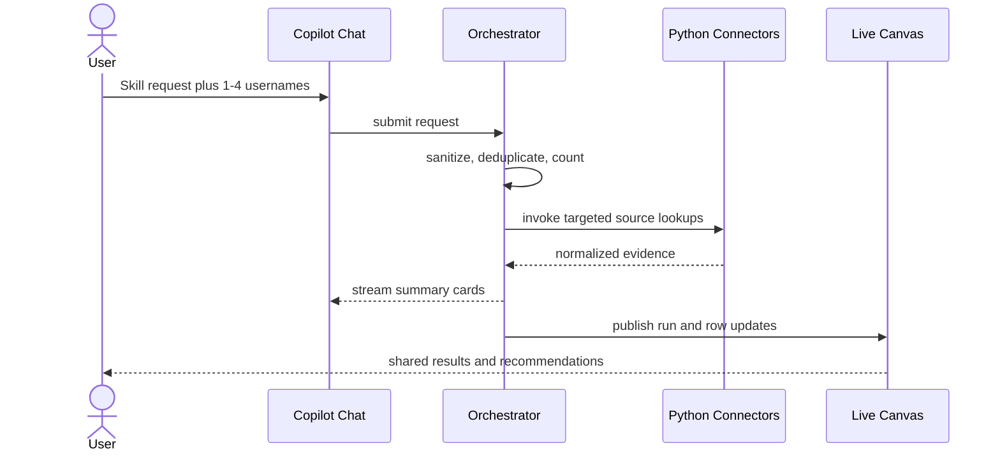
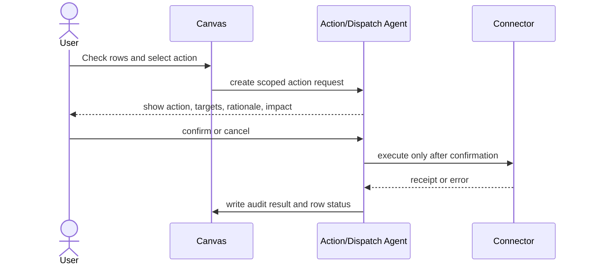

# Fleet Recon Product Requirements Document

## 1. Purpose

This PRD defines the MVP of Fleet Recon: a **prebaked chat window** over the operator’s existing Claude Code skills, MCP connections, and asset-ops scripts so non-developers can run org lookups without a CLI. The first skill is **"look up these users devices"** (ServiceNow + Jamf + Intune → Slack-style CSV in chat).

The earlier enterprise workspace (live canvas, OIDC, administrator credential vault, CrewAI, Postgres) is **out of MVP**. Those FRs remain in this document as Future Work so they are not lost; they are not required to ship the example request. Runtime: `claude-agent-sdk`. See [architecture-fork.md](architecture-fork.md) and [sad.md](sad.md).

## 2. Users and Permissions

MVP has one operational role:

- **Workspace User:** uses the prebaked chat, pastes names or CSV, receives `chat.csv_preview` (copy/download). Cannot see MCP credentials, SKILL.md, or scripts.

Administrator tool catalog, credential vault, connection diagnostics, live canvas collaboration, and confirmation-gated mutation console are **Future Work** (former FR-5 through FR-9). Credentials stay in MCP server configuration. If a write skill is later exposed, confirmation is required in chat before the host invokes a mutating tool.

## 3. MVP Experience

### 3.1 Application Layout

MVP is a single prebaked chat window (the existing React chat is fine as a thin client). Empty state lists skill chips such as **Look up users' devices**. The composer accepts natural language, pasted names, and CSV. Results render as `chat.csv_preview`. Canvas and Administrator Settings are hidden or inert.

The former two-panel chat+canvas layout and admin settings are Future Work.

The dashboard must remain useful without the chat pane: it renders persisted results and lets authorized users update work state. Chat commands and canvas actions must refer to the same server-side entities.

### 3.2 Primary User Flows

#### Configure Tools and Credentials (Administrator)

1. An Administrator opens Settings and selects a workspace.
2. Tool Management lists every registered Python tool, including display name, purpose, version, source integration, assigned agents, workspace state, and last validation time. The examples `asset_report_build.py`, `asset_report_mdm.py`, and `asset_report_app.py` are represented as registered capabilities rather than arbitrary executable file paths.
3. The Administrator enables or disables a tool for that workspace, assigns it to one or more permitted agents, and edits only parameters exposed by the tool's typed schema, such as ServiceNow state filters or platform allowlists.
4. The UI validates parameter types, allowed values, required fields, and safe bounds before save; it shows a proposed configuration diff and requires confirmation for changes that affect execution scope.
5. The Administrator opens Credential Management, selects an integration, enters or rotates its API credentials, and saves. The service validates the credential format, stores it in the approved secret manager, and does not persist plaintext in application data.
6. The Administrator runs a connection test or observes the scheduled health result. The UI displays the current diagnostic state, timestamp, latency when available, and a redacted actionable error; it never displays a token, secret, or authorization header.

Configuration changes apply only to new runs unless an active run explicitly supports a versioned configuration snapshot. Existing runs retain the tool and parameter versions used at start time.

#### Investigate a Small Set

#### Process a Batch

#### Request and Execute Remediation

## 4. Functional Requirements

### FR-1: Request Intake and Validation

- The system accepts typed requests, pasted usernames, and CSV uploads. Instruction prose (for example "look up these users devices") is classified as skill intent and is not counted as an identity.
- Sanitization trims whitespace, strips unsupported control characters, normalizes line endings, extracts allowed username values, removes duplicates, and reports rejected input without exposing sensitive raw content in logs.
- CSV uploads must enforce a configurable file-size and row-count limit, allowed MIME/type policy, required username column mapping, encoding handling, and malware scanning if the enterprise upload service requires it.
- Every accepted request creates a query run with a UUID, initiator, bound `skill_id`, input type, sanitized identity count, routing decision, status, and correlation ID.

### FR-2: Dual-Engine Routing

| Condition | Required Route | Behavior |
| --- | --- | --- |
| 1-4 unique identities and no CSV upload | Micro-query | Host sets `allowed_tools` from the intent table. The Agent SDK session calls ServiceNow/Jamf/Intune MCP tools in parallel per name. Stream progress; write session CSV; emit `chat.csv_preview`. |
| More than 4 unique identities | Batch automation | Host writes a temp username CSV and subprocesses `asset_report_build.py` then `asset_report_mdm.py`. Names stay out of model context. Same `chat.csv_preview`. |
| Any CSV upload | Batch automation | Validate and transform upload to internal CSV payload before job enqueue. |
| Invalid or empty normalized identities | Reject | Explain validation error and do not call connectors or agents. |

Routing is evaluated after skill binding, sanitization, and deduplication. The constant is `MICRO_QUERY_MAX_SUBJECTS = 4`. The decision must be stored and testable. A request never changes route mid-run; a retry creates a new run referencing the original run. Skill binding selects which connectors run; routing only selects micro-query vs batch execution of that skill.

### FR-3: Connector Collection

- Each registered skill declares its connector set. The MVP skill **Look up users' devices** (`lookup-user-devices`) always uses ServiceNow, Jamf Pro, and Microsoft Intune together; it does not call Cortex XDR, Tenable, or `asset_report_app`.
- ServiceNow supplies CMDB record, assignment/owner, lifecycle, and ticket context.
- Cortex XDR supplies active endpoint telemetry and operating-system classification (available to skills that declare it; not part of `lookup-user-devices`).
- Jamf Pro supplies macOS enrollment, MDM compliance, and permitted policy state.
- Microsoft Intune supplies Windows enrollment, MDM compliance, and management state.
- Tenable supplies vulnerability/compliance scan findings and last-seen status (available to skills that declare it; not part of `lookup-user-devices`).
- Connector adapters implement a shared Python contract: `validate_connection`, `fetch_by_identity`, `normalize`, `rate_limit`, `retry_safe`, and `redact_for_model`.
- Each response preserves source system, source record ID, retrieval timestamp, request correlation ID, status, raw-response retention reference, and normalized payload version.
- Individual connector failures must not invalidate evidence from other sources. The run reports partial completion and error detail appropriate to the user's role.

### FR-4: Analysis and Recommendations

- The Analysis Agent receives normalized, least-privilege JSON only. It may not receive credentials or unredacted raw payloads unless an approved policy explicitly permits a field.
- It identifies evidence conflicts and assigns a finding category and confidence: `cmdb_gap`, `unmanaged_device`, `stale_telemetry`, `ownership_mismatch`, `non_compliance`, `vulnerability_exposure`, or `insufficient_evidence`.
- It returns a structured playbook containing cited evidence IDs, explanation, confidence, recommended action, prerequisites, and whether approval is required.
- Low-confidence or incomplete findings must be labeled as such and may not automatically produce dispatchable remediation.

### FR-5, FR-6 (Future Work)

Live canvas collaboration and confirmation-gated mutation console are not required to ship device lookup in chat. If a write skill is later enabled, confirmation must happen in chat before the host invokes a mutating MCP tool.

### FR-7, FR-8, FR-9 (Future Work)

Administrator tool registry, credential vault, and connection-health console assumed an app-managed secret store. MVP credentials live in MCP server configs. Do not build these consoles to ship device lookup. The original FR-7/8/9 text remains in git history; it is not MVP scope.

### FR-10: Chat Result Artifacts

- When a skill produces tabular results, chat must render a first-class `chat.csv_preview` card: filename, row count, header row, a capped preview of data rows, truncation label, Copy, and Download.
- Both the ≤4 MCP path and the >4 script path emit this same payload. Preview is a bounded subset of a session-scoped report file, never a second LLM-written table.
- Copy and download must be usable in Excel or Google Sheets without a canvas.
- Artifacts exclude secrets, authorization headers, and unredacted raw vendor payloads.

## 5. Data and State Model

MVP persists a session run record (`intent_id`, identity count, `mode`, path to report CSV) and the `chat.csv_preview` file. The enterprise entity table below is **Future Work**.

| Entity | Required Fields | Notes |
| --- | --- | --- |
| Workspace | `id`, `tenant_id`, `name` | Collaboration boundary. |
| QueryRun | `id`, `workspace_id`, `initiator_id`, `skill_id`, `input_kind`, `input_count`, `mode`, `status`, `correlation_id`, timestamps | Immutable input metadata; status progresses queued/running/partial/completed/failed/cancelled. |
| Subject | `id`, `workspace_id`, `username`, `display_name`, `identity_confidence` | Canonical person identity. |
| Device | `id`, `subject_id`, `serial`, `hostname`, `os_family`, `canonical_status` | May link to multiple source IDs. |
| SourceEvidence | `id`, `device_id`, `query_run_id`, `source`, `source_record_id`, `retrieved_at`, `status`, `normalized_json_ref`, `schema_version` | Source-of-truth evidence and provenance. |
| Finding | `id`, `device_id`, `category`, `severity`, `confidence`, `evidence_ids`, `recommendation`, `state` | Agent result is structured and revisable. |
| CanvasWorkItem | `id`, `device_id`, `finding_id`, `checked`, `assignee_id`, `cmdb_cleanup_state`, `version` | Shared mutable canvas state. |
| Note | `id`, `work_item_id`, `author_id`, `body`, timestamps, `version` | Revisioned user commentary. |
| ActionRequest | `id`, `work_item_ids`, `operation`, `connector`, `parameters`, `status`, `requester_id`, `confirmed_at`, `idempotency_key`, timestamps | Confirmation and execution boundary. |
| WorkflowDefinition | `id`, `name`, `trigger_phrases`, `tool_ids`, `output_artifact`, `lifecycle_state` | Packaged Claude Code skill/workflow; tools are registered capabilities, not SKILL.md at runtime. |
| ToolDefinition | `id`, `name`, `version`, `integration`, `implementation_ref`, `input_schema`, `output_schema`, `agent_allowlist`, `mutability`, `lifecycle_state` | Approved Python capability registry; implementation reference is not executable user input. |
| ResultArtifact | `id`, `query_run_id`, `filename`, `media_type`, `row_count`, `object_ref`, `preview_json`, timestamps | Chat/canvas CSV (or other file) produced by a run; preview is a bounded row subset. |
| WorkspaceToolConfig | `id`, `workspace_id`, `tool_id`, `enabled`, `assigned_agents`, `parameters_json`, `version`, `updated_by`, timestamps | Workspace-scoped enablement, assignment, and validated parameters. |
| CredentialReference | `id`, `workspace_id`, `integration`, `secret_manager_ref`, `version`, `state`, `updated_by`, timestamps | Opaque reference and lifecycle metadata only; no plaintext secret. |
| ConnectionHealthCheck | `id`, `workspace_id`, `integration`, `credential_version`, `state`, `latency_ms`, `redacted_message`, `correlation_id`, `checked_at` | Diagnostic history and current integration health. |
| AuditEvent | `id`, `entity_type`, `entity_id`, `actor_id`, `event_type`, `before_json`, `after_json`, `correlation_id`, timestamp | Append-only event history. |

`cmdb_cleanup_state` values: `not_needed`, `needs_review`, `ticket_requested`, `in_progress`, `resolved`, `not_actionable`.

## 6. Session runtime (MVP)

There is no CrewAI Orchestrator/Analysis/Dispatch crew in MVP. The session host:

1. Matches intent (device lookup / app health / security) and locks MCP `allowed_tools`.
2. Routes ≤4 vs >4.
3. For ≤4, lets the Agent SDK call only those MCP tools in parallel.
4. For >4, execs the asset-ops scripts itself.
5. Always renders `chat.csv_preview`.

Former agent specs are Future Work with the enterprise workspace.

## 7. Non-Functional Requirements

- **Security:** MCP credentials stay in server config; chat and CSV never include secrets. The session host is not an open internet proxy to org APIs.
- **Performance:** ≤4 first progress within 10 seconds; batch does not iterate names in the model.
- **Testing:** unit tests for sanitization, stopwords, threshold 4, intent allowlists; integration tests against MCP fixtures or recorded MCP payloads.

## 8. Prioritized Product User Stories and Acceptance Criteria

### P0: Packaged Skill for Non-Developers

**US-8: Look up users' devices from chat**

As a Workspace User, I want to ask "look up these users devices" and paste names so that ServiceNow, Jamf, and Intune evidence comes back as a spreadsheet-ready CSV in chat.

- **AC-8.1:** Instruction prose is not treated as usernames; 1–4 unique identities take micro-query (MCP in parallel); 5 or more, or any CSV, take host-invoked `asset_report_build` then `asset_report_mdm`.
- **AC-8.2:** Device-lookup intent does not invoke `asset_report_app`, Cortex XDR, or Tenable.
- **AC-8.3:** Chat shows `chat.csv_preview` (preview, copy, download). Canvas is not required.
- **AC-8.4:** For >4 names, the model does not receive the identity list. For ≤4, MCP `allowed_tools` is locked to the intent table.

US-1 through US-7 (credential vault, health console, tool admin, canvas, analysis playbooks) are **Future Work**.

## 9. MVP Acceptance Criteria

1. A request with four unique valid identities and no CSV routes to micro-query (MCP); one with five routes to host-invoked scripts after normalization. Instruction words in "look up these users devices" are not identities.
2. A CSV upload takes the script path regardless of row count. The user-facing download is the device result file, not the upload.
3. A partial MCP or script failure still produces `chat.csv_preview` with per-source error columns.
4. Device-lookup intent does not call Cortex, Tenable, or `asset_report_app`.
5. Copy and Download work from the chat card without a canvas.

Canvas collaboration, OIDC admin vault, and confirmation-gated mutations are not MVP acceptance criteria.

## Sources

- Product brief supplied by the requestor on 2026-08-26.
- Requestor skill-packaging goal and device-lookup example on 2026-08-29.
- Claude session-host proposal compared in [architecture-fork.md](architecture-fork.md).
- [mrd.md](mrd.md).
- [aamad.config.yml](../../aamad.config.yml).
- [sfs/lookup-user-devices.md](sfs/lookup-user-devices.md).

## Assumptions

- Existing ServiceNow/Jamf/Intune MCP servers in `development-test2` are the connectors for MVP.
- Exact MCP tool names are confirmed at implementation time.
- The FastAPI/CrewAI scaffold is leftover, not the ship target.

## Open Questions

- Session-host process shape (Agent SDK behind the Vite chat vs Claude Code UI).
- Session file retention and multi-user isolation.
- Whether app-health and vuln intents ship with device lookup.

## Audit

- 2026-08-26 | product-mgr | Created PRD from supplied specifications; selected runtime recorded as CrewAI from project configuration.
- 2026-08-27 | product-mgr | Added administrator tool management and extensibility, credential vault and diagnostics, explicit RBAC boundaries, prioritized user stories, and acceptance criteria.
- 2026-08-29 | system-arch | Session-host MVP: Claude Agent SDK + MCP + asset-ops scripts; FR-5–FR-9 Future Work; `chat.csv_preview`; threshold 4; US-8. See architecture-fork.md.