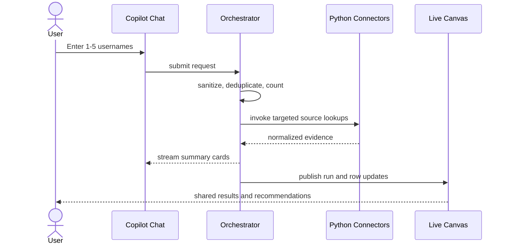
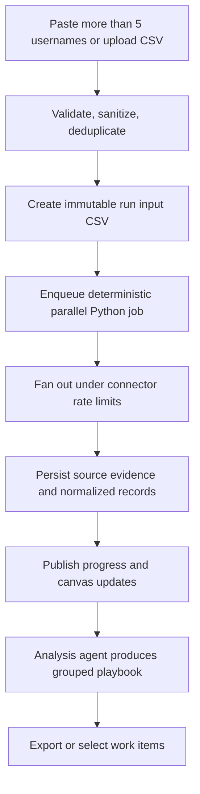
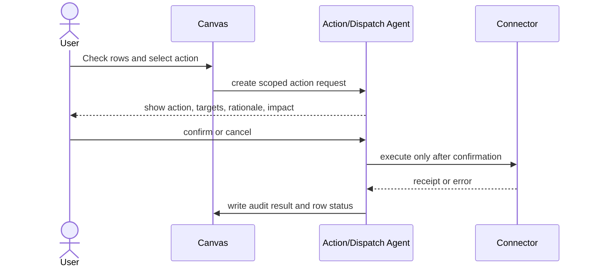

# Fleet Recon Product Requirements Document

## 1. Purpose

This PRD defines the MVP of Fleet Recon: a collaborative endpoint reconciliation workspace that collects telemetry from ServiceNow, Cortex XDR, Jamf Pro, Microsoft Intune, and Tenable; displays normalized evidence on a live canvas; and drives approved remediation actions.

## 2. Users and Permissions

The MVP has one **User** role. Users can run queries, view and export results, update shared canvas state, add notes, assign work, and request or confirm a scoped remediation action.

Configuration is not a role in the MVP: only the designated administrator manages connectors, credentials, and action allowlists. All mutations must capture the authenticated actor, workspace, timestamp, entity version, and correlation ID.

## 3. MVP Experience

### 3.1 Application Layout

The desktop-first application has two independently scrollable panels:

- **Copilot Chat, left:** accepts natural-language requests, pasted usernames, and CSV uploads; renders lightweight result cards, run status, errors, and action-confirmation prompts. A `+` menu exposes CSV upload and permitted integration actions; connector configuration is restricted to the designated administrator.
- **Live Canvas Dashboard, right:** displays shared filter controls, a user table, a device/evidence table or drill-down, assignment and note state, CMDB cleanup status, run activity, and CSV export.

The dashboard must remain useful without the chat pane: it renders persisted results and lets authorized users update work state. Chat commands and canvas actions must refer to the same server-side entities.

### 3.2 Primary User Flows

#### Investigate a Small Set

#### Process a Batch

#### Request and Execute Remediation

## 4. Functional Requirements

### FR-1: Request Intake and Validation

- The system accepts typed requests, pasted usernames, and CSV uploads.
- Sanitization trims whitespace, strips unsupported control characters, normalizes line endings, extracts allowed username values, removes duplicates, and reports rejected input without exposing sensitive raw content in logs.
- CSV uploads must enforce a configurable file-size and row-count limit, allowed MIME/type policy, required username column mapping, encoding handling, and malware scanning if the enterprise upload service requires it.
- Every accepted request creates a query run with a UUID, initiator, input type, sanitized count, routing decision, status, and correlation ID.

### FR-2: Dual-Engine Routing

| Condition | Required Route | Behavior |
| --- | --- | --- |
| 1-5 unique usernames and no CSV upload | Micro-query | Orchestrator parses intent, calls targeted Python connector methods, and streams compact chat cards while persisting equivalent evidence to the canvas. |
| More than 5 unique usernames | Batch automation | Create internal sanitized CSV payload, enqueue deterministic parallel Python job, publish progress, and return aggregated results. |
| Any CSV upload | Batch automation | Validate and transform upload to internal CSV payload before job enqueue. |
| Invalid or empty normalized input | Reject | Explain validation error and do not call connectors or agents. |

Routing is evaluated after sanitization and deduplication. The decision must be stored and testable. A request never changes route mid-run; a retry creates a new run referencing the original run.

### FR-3: Connector Collection

- ServiceNow supplies CMDB record, assignment/owner, lifecycle, and ticket context.
- Cortex XDR supplies active endpoint telemetry and operating-system classification.
- Jamf Pro supplies macOS enrollment, MDM compliance, and permitted policy state.
- Microsoft Intune supplies Windows enrollment, MDM compliance, and management state.
- Tenable supplies vulnerability/compliance scan findings and last-seen status.
- Connector adapters implement a shared Python contract: `validate_connection`, `fetch_by_identity`, `normalize`, `rate_limit`, `retry_safe`, and `redact_for_model`.
- Each response preserves source system, source record ID, retrieval timestamp, request correlation ID, status, raw-response retention reference, and normalized payload version.
- Individual connector failures must not invalidate evidence from other sources. The run reports partial completion and error detail appropriate to the user's role.

### FR-4: Analysis and Recommendations

- The Analysis Agent receives normalized, least-privilege JSON only. It may not receive credentials or unredacted raw payloads unless an approved policy explicitly permits a field.
- It identifies evidence conflicts and assigns a finding category and confidence: `cmdb_gap`, `unmanaged_device`, `stale_telemetry`, `ownership_mismatch`, `non_compliance`, `vulnerability_exposure`, or `insufficient_evidence`.
- It returns a structured playbook containing cited evidence IDs, explanation, confidence, recommended action, prerequisites, and whether approval is required.
- Low-confidence or incomplete findings must be labeled as such and may not automatically produce dispatchable remediation.

### FR-5: Live Canvas Collaboration

- Users can filter by run, owner, platform, connector state, finding category, compliance, assignment, and CMDB cleanup state.
- Authorized users can change a row's checked state, add/edit notes, assign a work item, select CMDB cleanup status, and create an action request.
- Updates are server-authoritative and broadcast to active collaborators within five seconds.
- Concurrent edits must use optimistic concurrency/version checks. On conflict, the client presents the current state and preserves unsaved note text for resolution.
- An append-only activity stream records state transitions, actor, timestamp, prior/new values, and originating run/action.
- CSV export honors active filters and includes export generation time and data-source timestamps.

### FR-6: Confirmation-Gated Actions

- Action/Dispatch Agent converts selected canvas work items into a previewable action request, never a direct connector mutation.
- An action request must list targets, connector, operation, requested parameters, evidence rationale, blast-radius count, requester, confirmation status, expiration, and idempotency key.
- Heavy MDM scans and all state-changing operations require explicit user confirmation. Confirmation UI appears in chat and is reflected on the canvas.
- Jamf policies and ServiceNow ticket creation are the only action integrations in MVP, controlled by an administrator-maintained allowlist.
- Cancellations, expirations, execution receipts, and failures are durable audit events. Retrying a failed action requires a new confirmed request.

## 5. Data and State Model

| Entity | Required Fields | Notes |
| --- | --- | --- |
| Workspace | `id`, `tenant_id`, `name` | Collaboration boundary. |
| QueryRun | `id`, `workspace_id`, `initiator_id`, `input_kind`, `input_count`, `mode`, `status`, `correlation_id`, timestamps | Immutable input metadata; status progresses queued/running/partial/completed/failed/cancelled. |
| Subject | `id`, `workspace_id`, `username`, `display_name`, `identity_confidence` | Canonical person identity. |
| Device | `id`, `subject_id`, `serial`, `hostname`, `os_family`, `canonical_status` | May link to multiple source IDs. |
| SourceEvidence | `id`, `device_id`, `query_run_id`, `source`, `source_record_id`, `retrieved_at`, `status`, `normalized_json_ref`, `schema_version` | Source-of-truth evidence and provenance. |
| Finding | `id`, `device_id`, `category`, `severity`, `confidence`, `evidence_ids`, `recommendation`, `state` | Agent result is structured and revisable. |
| CanvasWorkItem | `id`, `device_id`, `finding_id`, `checked`, `assignee_id`, `cmdb_cleanup_state`, `version` | Shared mutable canvas state. |
| Note | `id`, `work_item_id`, `author_id`, `body`, timestamps, `version` | Revisioned user commentary. |
| ActionRequest | `id`, `work_item_ids`, `operation`, `connector`, `parameters`, `status`, `requester_id`, `confirmed_at`, `idempotency_key`, timestamps | Confirmation and execution boundary. |
| AuditEvent | `id`, `entity_type`, `entity_id`, `actor_id`, `event_type`, `before_json`, `after_json`, `correlation_id`, timestamp | Append-only event history. |

`cmdb_cleanup_state` values: `not_needed`, `needs_review`, `ticket_requested`, `in_progress`, `resolved`, `not_actionable`.

## 6. AI Agent Specifications

### Orchestrator Agent

**Purpose:** classify the request, validate it, select micro-query or batch route, coordinate progress, and enforce confirmation gateways.

**Permitted tools:** request sanitizer; query-run store; read-only connector dispatcher; deterministic batch-job enqueuer; canvas event publisher; action-request creator.

**Prohibited tools/actions:** direct state-changing connector calls; secrets access; confirmation inference; raw payload export.

**Prompt contract:** "Use only validated request metadata and permitted normalized evidence. Determine the route strictly from the routing table. For any heavy scan or mutation, create a confirmation request with scope and impact. Return structured status, correlation ID, and user-safe explanation."

### Analysis Agent

**Purpose:** correlate normalized evidence, identify discrepancies, and prepare evidence-backed playbooks.

**Permitted tools:** read-only normalized evidence retrieval; findings store; policy/rule catalog.

**Prohibited tools/actions:** connector mutation; ticket creation; MDM policy invocation; unsupported conclusions when evidence is absent.

**Prompt contract:** "Compare only provided evidence. Cite evidence IDs for every claim. Return a machine-valid finding category, confidence, explanation, and recommended next action. When evidence conflicts or is insufficient, say so and recommend verification rather than remediation."

### Action/Dispatch Agent

**Purpose:** translate confirmed, selected work items into administrator-allowlisted ServiceNow or Jamf operations and record the outcome.

**Permitted tools:** selected-work-item reader; action-request store; confirmation verifier; allowlisted ServiceNow ticket creator; allowlisted Jamf policy trigger; audit-event writer.

**Prohibited tools/actions:** bypassing confirmation, broadening target scope, unallowlisted operation execution, or direct mutation from model-generated parameters without schema validation.

**Prompt contract:** "Construct an action preview from selected work items. Validate schema, target set, allowlist, and unexpired confirmation before execution. Execute exactly the confirmed operation once using the idempotency key. Return per-target receipts and update the audit trail."

## 7. Non-Functional Requirements

- **Security:** secrets are stored in approved secret management only; browser/API responses are redacted as required by workspace policy; least-privilege credentials and audit logging are mandatory.
- **Performance:** micro-query chat feedback begins after the first available connector response; batch workload is parallelized within per-connector rate limits and reports progress without model polling loops.
- **Reliability:** jobs are retryable at safe boundaries, connector calls use bounded retry/backoff, and idempotency protects state-changing operations.
- **Observability:** structured logs, metrics, traces, correlation IDs, connector health, job queue depth, routing counts, and action outcomes are required.
- **Accessibility:** keyboard-accessible core table and action controls, status announcements, and contrast-compliant state indicators.
- **Testing:** unit tests cover sanitization, routing threshold, normalization, administrator configuration restrictions, confirmation checks, concurrency behavior, and CSV export; integration tests cover each connector contract plus the confirmed action path.

## 8. MVP Acceptance Criteria

1. A request with five unique valid usernames routes to micro-query; one with six routes to batch after normalization.
2. A CSV upload routes to batch regardless of row count and produces an internal sanitized CSV reference.
3. A partial connector failure yields visible partial results and source-specific errors without discarding successful evidence.
4. Two authorized users viewing the same workspace observe an assignment or check-state update within five seconds.
5. A stale row version cannot overwrite a newer server-side state without a conflict response.
6. The analysis result cites source-evidence IDs and labels insufficient evidence.
7. A Jamf policy or ServiceNow ticket operation cannot execute without a matching confirmed, unexpired action request and audit record.
8. An export reflects active filters and workspace data policy.

## Sources

- Product brief supplied by the requestor on 2026-08-26.
- [mrd.md](mrd.md).
- [aamad.config.yml](../../aamad.config.yml).

## Assumptions

- A web backend, relational persistence layer, durable job queue, and real-time event channel will be selected in the SAD.
- Connector-specific rate limits and field availability will be captured during integration design.

## Open Questions

- What is the intended browser support matrix and expected concurrent-user count?
- Which actions qualify as a "heavy MDM scan," and what is the maximum permitted target count per confirmation?
- Which system is authoritative when identity or platform classification conflicts?
- What approvals are needed before collecting telemetry from managed endpoints?

## Audit

- 2026-08-26 | product-mgr | Created PRD from supplied specifications; selected runtime recorded as CrewAI from project configuration.