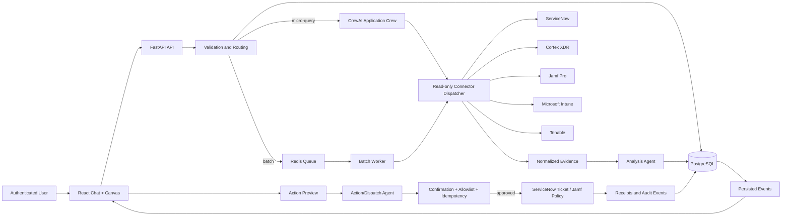

# Fleet Recon MVP Solution Architecture Document

## Context

This document translates the [Fleet Recon Product Requirements Document](prd.md) and [Market Requirements Document](mrd.md) into an implementable MVP architecture.

**Architecture fork (2026-08-29):** the ship MVP is a **thin session host** wrapping Claude Code / Claude Agent SDK, existing org MCP servers, and `asset-ops` skills — the shape already validated in `development-test2`. It is **not** a CrewAI + FastAPI + PostgreSQL + Redis + OIDC enterprise workspace. That stack remains documented below only as **Future Work**. Comparison and rationale: [architecture-fork.md](architecture-fork.md).

The first packaged workflow is **Look up users' devices** (`lookup-user-devices`). See [sfs/lookup-user-devices.md](sfs/lookup-user-devices.md).

**Selected runtime:** `claude-agent-sdk`

**Primary language:** Python 3.11+ (skills/scripts) and TypeScript (chat UI)

**MVP deployment shape:** one session host (chat UI + Agent SDK process) with connected MCP servers (ServiceNow, Jamf, Intune) and a session-scoped temp/reports directory. No separate worker tier, PostgreSQL, Redis, or productized secret vault.

## 1. MVP Architecture Philosophy & Principles

### 1.1 Design Principles

1. **Wrap what already works.** MCP connections and asset-ops scripts are the system of action. The product is a non-developer chat window over them, not a second integration platform.
2. **Host decides; model fills the allowed slot.** Skill bind (`device-lookup` vs `asset-ops`) and the intent → tool-subset table are deterministic host rules. The model cannot add Cortex/Tenable to a device lookup, and it cannot fire `device-lookup` once per pasted name.
3. **Same CSV output for every name list.** Pasted names (including 4) and CSV uploads terminate in `chat.csv_preview` with the step 1+2 column set. Single-identifier `device-lookup` is a conversational card, not four CSV novels.
4. **Deterministic routing.** Skill binding, sanitization, and deduplication happen before the session is given tools. The stored route never changes during a run.
5. **Partial failure is a result state.** A failed MCP/script source does not erase successful rows. The CSV still downloads.
6. **Least privilege per intent.** `allowed_tools` is the intent table, not the full MCP catalog. Script steps 1–4 use `passkey` profiles, not an app vault. Secrets stay in MCP/`passkey` config.
7. **Name-list scripts are host-invoked.** Any pasted name list or CSV writes a temp CSV and execs `asset_report_build.py` then `asset_report_mdm.py` with a fixed argv. The model does not get unconstrained Bash and does not read the CSV body (script stdout summary only).
8. **Evidence before inference.** CSV rows come from script output (or MCP payloads for one-id lookup), not from model-authored tables.

### 1.2 MVP Scope

**Included:**

- Prebaked chat window (existing React chat is acceptable as a thin client). Skill chips, not a generic coding agent.
- Typed requests, pasted usernames, and CSV upload, with instruction prose stripped from identity extraction.
- Host-side skill bind: one serial/hostname/user → `device-lookup` MCP; pasted name list or CSV (any count) → host-invoked `asset-ops` steps 1 then 2.
- Intent → tool-subset table (device lookup vs app health vs security/vuln). `MICRO_QUERY_MAX_SUBJECTS = 4` is only a cap **if** a later live-card MCP fan-out is added; it is not the default for a name list.
- `asset_report_build.py` → `asset_report_mdm.py` for every name list and CSV (already specified in §2.2 / §2.3). Agent reads the script summary, never the CSV body.
- One `chat.csv_preview` renderer (inline table, Copy, Download) for both paths, backed by a session-scoped reports file.
- Claude Agent SDK session with per-intent `allowed_tools` and MCP servers already configured.

**Explicitly deferred (former MVP enterprise stack):**

- CrewAI Application Crew, PostgreSQL evidence model, Redis queue, object-storage run CSVs, OIDC, administrator tool/credential/health console, live canvas collaboration, WebSockets, confirmation-gated mutation console (until a write skill is exposed).
- Autonomous remediation or automatic CMDB deletion/bidirectional synchronization.
- A full replacement console for any source platform.

### 1.3 Technical Architecture Decisions

| Concern | MVP decision | Rationale |
| --- | --- | --- |
| Session host | One process serving the chat UI and a Claude Agent SDK (or Claude Code) session | Matches `development-test2`: skills + MCP, no distributed backend. |
| Agent runtime | `claude-agent-sdk` coordinator with per-intent `allowed_tools` | Replaces CrewAI. Hooks (`PreToolUse`) enforce the intent table. |
| Connectors | Existing MCP servers (ServiceNow, Jamf, Intune) for `device-lookup` and optional asset-ops step 1.5; `passkey run servicenow|jamf_api|intune` for asset-ops steps 1–4 | Credentials already live in MCP/`passkey` config; no app vault. Tenable/Cortex only when the intent table says so. |
| Single identifier | `device-lookup` MCP immediately (`jamf_get_device_summary`, `intune_lookup_device`, `snow_lookup_user_profile`) | Matches `docs/.claude/skills/device-lookup/SKILL.md`. Tenable only for vuln phrasing. |
| Name list or CSV | Host writes temp CSV and subprocesses `asset_report_build.py` then `asset_report_mdm.py` | Matches `docs/.claude/skills/asset-ops/SKILL.md` (MCP none for steps 1–4 except optional 1.5). Host-invoked, not free Bash. |
| Result files | Session-scoped temp/reports directory | Same pattern as existing report scripts; no object store for MVP. |
| Chat render | First-class `chat.csv_preview` (headers, preview rows, row_count, file_ref, copy, download) | Identical renderer for both routes. |
| Frontend | Keep the existing React chat as a thin client; hide canvas/admin or leave them inert | Non-developers need a window, not a second platform. |
| Auth (MVP) | Private internal access to the session host; not a productized OIDC/RBAC console | Must not be an open proxy to org MCP. Full OIDC is Future Work. |
| Future Work platform | FastAPI + PostgreSQL + Redis + OIDC + tool registry + canvas | Former SAD §4; do not build it to ship device lookup. |

## 2. Multi-Agent System Specification

### 2.1 Session host (replaces Application Crew for MVP)

There is no CrewAI crew in MVP. One coordinator session (Claude Agent SDK) runs inside the session host. Specialized “agents” from the former SAD (Orchestrator / Analysis / Dispatch) are **not** separate CrewAI roles. Routing and tool allowlists are host code.

| Component | Goal | Inputs | Outputs | Hard boundary |
| --- | --- | --- | --- | --- |
| Intent + identity preprocessor | Bind skill (`device-lookup` vs `asset-ops`) and intent table row; extract identities | Raw chat text or CSV | `intent_id`, `skill_id`, identity list or identifier, `mode`, `allowed_tools` | Must not call MCP or scripts itself except through the paths below |
| Claude Agent SDK session | Present script summaries / `chat.csv_preview` for name lists; call MCP only for `device-lookup` (one id) or optional step 1.5 | Preprocessor result; MCP tools only when `mode=device_lookup` (or step 1.5) | Path to report CSV or conversational lookup card; user-safe status | Cannot expand `allowed_tools`; cannot invoke unconstrained Bash; cannot read CSV body into context |
| Host script runner | Pasted name list (any count) or CSV upload | Sanitized username CSV path | Report CSV in session reports dir | Fixed argv: `asset_report_build.py` then `asset_report_mdm.py` (plus `asset_report_app.py` only if intent is app health). Optional step 1.5 MCP fill is a separate host-gated step. |
| `chat.csv_preview` renderer | Slack-style file card | Report CSV from asset-ops | Preview, copy, download | Same component for 4 names and 50 names |

Former Orchestrator/Analysis/Dispatch CrewAI specifications remain Future Work if the enterprise workspace is built later.

### 2.2 Tool Capability Model

The three supplied scripts are treated as approved capability adapters, not as unrestricted shell commands or user-uploaded code. The worker invokes a registered tool implementation through an internal Python interface and supplies an immutable `ToolExecutionContext` containing `workspace_id`, `run_id`, correlation ID, input object reference, effective tool/configuration/credential versions, and a cancellation signal. The adapter returns typed per-device evidence and safe telemetry; it does not write directly to a user-selected filesystem path or expose raw credentials.

| Capability | Source and behavior | Inputs and configuration | Typed output and architecture treatment |
| --- | --- | --- | --- |
| `asset_report_build` | Step 1. Resolves usernames through ServiceNow `sys_user`, fetches assigned `alm_hardware`, derives platform from model/manufacturer metadata, and emits one row per device or an explicit no-device/not-found row. | Sanitized username CSV; `states` allowlist such as `In use,In stock`; `platforms` allowlist such as `macOS,Windows`; batch size remains an implementation limit. | `DeviceInventoryEvidence` with username, serial, model, manufacturer, platform, state, substate, asset tag, and safe skip reason. ServiceNow calls use the ServiceNow connector and its configured credential reference. |
| `asset_report_mdm` | Step 2. Routes macOS rows to batched Jamf inventory (`GENERAL`, `HARDWARE`) and Windows rows to Intune serial lookup plus managed-device metadata. Preserves duplicate serial rows and marks not-found/lookup-error states explicitly. | Step 1 device evidence; `jamf_batch_size`, `intune_workers`, and max-age policy are bounded worker settings, not unrestricted user flags. | `MdmEvidence` with provider, managed/unmanaged/not-found status, last check-in, compliance, management agent, detail, source record reference, and safe error category. Jamf and Intune calls use separate connector credentials and rate limits. |
| `asset_report_app` | Step 3. For macOS, resolves an app-specific Jamf extension attribute first and falls back to Jamf application inventory; for Windows, queries Intune managed-app states. Classifies raw status as healthy/unhealthy/unknown and preserves provenance. | Step 1 device evidence; required `app` value; approved per-app signal-map rule; bounded Jamf batch size and Intune worker count. Signal-map rules are versioned configuration, not arbitrary executable logic. | `ApplicationEvidence` with app, raw status, health classification, source, versions/detail, and safe error category. EA ambiguity and fallback source are explicit evidence metadata. |

The scripts currently use CLI arguments, environment variables, `requests`, `pandas`, `PyYAML`, and a shared `fleet_common` module. **MVP uses them as subprocesses** for every name list and CSV rather than reimplementing them as FastAPI connectors or as N parallel MCP novels. Do not wrap them in a job queue to ship device lookup. Future Work may still turn CLI flags into schema-backed config if the enterprise workspace is built.

### 2.3 Script Pipeline and Execution Controls

For a **name-list or CSV** run, the **session host** executes the scripts in order (not a Redis worker):

1. `asset_report_build` consumes the sanitized input CSV and produces the canonical device set.
2. `asset_report_mdm` consumes eligible device rows and fans out by platform (Jamf batch, Intune per-device) as the scripts already do.
3. `asset_report_app` runs only when the intent table row is app health.
4. Script CSV/JSONL output is the result file. The host does not persist a PostgreSQL evidence graph for MVP.
5. The host then emits `chat.csv_preview` from that file.

The host must not pass arbitrary user environment into the subprocess. MCP/script credentials come from the existing MCP server config and script env, not from chat. Human-readable stdout is not the chat contract; the report file is.

### 2.4 Claude Agent SDK session (MVP)

Secrets and model credentials come from environment variables (`ANTHROPIC_API_KEY` and MCP server env). Per-request controls:

- `allowed_tools`: computed from the intent table (below). Name-list device lookup = **no MCP** for steps 1–4 (passkey scripts). Single-id `device-lookup` = ServiceNow + Jamf + Intune MCP tools only. Optional asset-ops step 1.5 = `jamf_get_user_devices` and `intune_lookup_users` only.
- `PreToolUse` hook: reject any tool not on that list (including Tenable/Cortex and unconstrained Bash).
- Turn/token budget: sized so the model never ingests the CSV body; it reads script summaries only. Name-list path should not spend turns iterating names.
- No persistent agent memory across requestors; session files are the retention.

CrewAI YAML (`backend/agents/config/*.yaml`) is not used for MVP. It remains in the repo only as leftover from the enterprise scaffold.

### 2.5 Task and Turn Orchestration

#### Shared preprocessor

1. Session host accepts chat text or CSV from the thin UI.
2. Match intent (table in §2.8). Strip instruction prose. Sanitize and deduplicate identities.
3. If the phrase matches but no identities remain, ask for names. Do not call MCP or scripts.
4. Skill bind and persist `mode` on the session run record (in-memory or session file is enough):
   - **One** serial, hostname, or username and no CSV / no pasted list → `device_lookup`.
   - Pasted **name list** (any unique count after sanitization, including 4) or any CSV → `asset_ops`.
   Never bind `device-lookup` once per name in a list. `MICRO_QUERY_MAX_SUBJECTS = 4` is not used to choose MCP vs scripts for a list.

#### Single-identifier (`device_lookup`)

1. Set `allowed_tools` from `docs/.claude/skills/device-lookup/SKILL.md` (e.g. `jamf_get_device_summary`, `intune_lookup_device`, `snow_lookup_user_profile`). Tenable only if the phrasing is vulnerability assessment.
2. Run the Agent SDK session so the primary MCP tool runs **immediately** for that one identifier.
3. Render a conversational lookup card (OS/compliance/last check-in/assigned user). This path is not the Slack CSV card unless the operator later asks to export.

#### Name list or CSV (`asset_ops`)

1. Host writes a temp username CSV (`Usernames` / `Username` / `Email` / `User Email` as in the skill). Domains are stripped by the scripts.
2. Host subprocess: `passkey`-style env + `asset_report_build.py` then `asset_report_mdm.py` (and `asset_report_app.py` only for app-health intent). Optional step 1.5 is host-gated MCP (`jamf_get_user_devices`, `intune_lookup_users`) and is **not** the default for "look up these users devices".
3. Host reads the script output file, emits **`chat.csv_preview`**. The model is given the compact stdout **summary**, never the CSV body, and is not given the name list to iterate. Unconstrained Bash is not allowed.

#### Action flow

Deferred. If a write skill is later enabled, confirmation must happen in chat before the host invokes a mutating MCP tool. Do not infer confirmation.

### 2.6 Context and Output Contracts

MVP agent context:

- `intent_id`, `skill_id`, `mode`, `input_count`, correlation/session id.
- For `device_lookup`: the single identifier may be in session context.
- For `asset_ops`: identity list is **not** in model context; only “asset-ops job on N names” plus path to the result file after the host finishes. Script stdout summary may be in context; CSV body must not.
- No MCP/`passkey` tokens, raw vendor dumps, or unrestricted query strings in traces.

Name-list / CSV runs must emit `chat.csv_preview` with **asset-ops step 1+2 columns**:

```json
{
  "type": "chat.csv_preview",
  "filename": "devices-<session>-<run>.csv",
  "headers": ["Username", "Serial", "Platform", "State", "Substate", "Model", "Asset Tag", "Notes", "MDM", "MDM Status", "MDM Last Check-In", "MDM Detail"],
  "preview_rows": [],
  "row_count": 0,
  "truncated": false,
  "file_ref": "session-reports relative path"
}
```

Copy and Download use that file. Preview cap: 10 data rows.

### 2.7 Error Handling, Retry, Cancellation, and Budgets

- MCP/script errors become per-row `Notes` / `MDM Detail` (or equivalent skip/error cells). Other identities continue.
- Host subprocess failure: run `failed` or `partial` if a report file still has rows.
- Cancellation: stop starting new MCP calls / kill the script process if still running; keep files already written.
- `device_lookup` target: first progress within 10 seconds; complete within 30 seconds excluding vendor outage.
- `asset_ops`: accept immediately; stream script progress if available; do not poll via extra model turns. Four names and fifty names use the same engine.

### 2.8 Intent table and skill pack

Claude Code skills **are** the runtime (SKILL.md + scripts + MCP), not a packaging step into Postgres `WorkflowDefinition` rows. The chat window is prebaked: chips map to intent rows. Non-developers never open SKILL.md or a terminal.

Authoritative pack: `docs/.claude/skills/` (`origin/master` `af27545`).

| Intent | Example phrasing | MCP / scripts | Forbidden |
| --- | --- | --- | --- |
| Device lookup (name list) | "look up these users devices" + pasted names or CSV | Host-invoked `asset_report_build` → `asset_report_mdm`. MCP **none** for steps 1–4. Optional step 1.5 only if asked to fill SN gaps. | Cortex, Tenable, `asset_report_app`, N× `device-lookup` |
| Device lookup (one id) | one serial, hostname, or user; no list | `device-lookup` MCP: `jamf_get_device_summary`, `intune_lookup_device`, `snow_lookup_user_profile` | Cortex; Tenable unless vuln phrasing; asset-ops CSV pipeline |
| App health | app / extension-attribute asks | Device-lookup name-list set **plus** `asset_report_app` | Cortex, Tenable unless also asked |
| Security / vuln | vulnerability, exposure, Tenable, Cortex | `device-lookup` / vuln skill **plus** Tenable MCP (Cortex only if the skill declares it) | Unrelated mutation tools; `jamf_group_sync` without confirm |

| Claude Code path | MVP use |
| --- | --- |
| `docs/.claude/skills/asset-ops/SKILL.md` | Pasted-name-list / spreadsheet path (steps 1 then 2 for this example) |
| `docs/.claude/skills/device-lookup/SKILL.md` | One identifier, MCP immediately, no ticket |
| `scripts/asset_report_build.py` | Step 1 (passkey `servicenow`) |
| `scripts/asset_report_mdm.py` | Step 2 (passkey `jamf_api` / `intune`) |
| `scripts/asset_report_app.py` | App-health intent only |
| `scripts/jamf_group_sync.py` | Write skill; confirmation required; `--mode replace` is dangerous |

## 3. Frontend Architecture Specification

> **Ratified 2026-08-30 (`system-arch`, with amendments — see Audit).** `@backend.eng` rewrote this section as a stopgap on 2026-08-30 because `architecture-fork.md`'s 2026-08-29 revision list covered §1.2/§1.3/§2 but never touched §3, leaving it specifying the dropped enterprise workspace/admin/action-request/SSE UI that the 2026-08-27 frontend pass (`frontend.md`) built against the wrong backend. `@system.arch` reviewed the rewrite against `backend.md` and the live `session-host/fleet_session_host/` source and **confirms the MVP boundary below**: one private chat surface (plus optional client-derived canvas) over exactly the session host's routes (`POST /api/v1/runs`, `GET /api/v1/runs/{id}`, `GET /api/v1/health`, `GET /api/v1/ready`), no workspace/admin/action-request model, bounded polling instead of SSE/WebSocket — nothing the client can't actually call. Two corrections were made rather than accepting the draft verbatim: (1) §3.3's run-card `status` list overstated a `rejected` run state that the backend never actually produces — corrected below; (2) Open Questions #13 (full-CSV download) and #14 (`/health` screen) are resolved as architecture decisions, not left open. See §3.3, Open Questions, and Audit.

### 3.1 Technology Stack

- React 18+ and TypeScript.
- Vite for the frontend build and local development server.
- Accessible, unopinionated component primitives with project-owned styling; no mandatory vendor UI dependency.
- React Query or an equivalent server-state library for run status; local component state for draft composer text.
- **Bounded polling of `GET /api/v1/runs/{id}`, not SSE/WebSocket.** The session host has no push transport (`backend.md` Known Gaps); the client stops polling after a fixed timeout (frontend's first pass used 30s) and explains a still-`queued`/`running` run rather than spinning forever.
- CSV upload through `multipart/form-data` (`file` field, 5 MiB server-enforced limit per `backend.md`) with matching client-side size/type hints; the server remains authoritative.

### 3.2 Application Structure

```text
frontend/src/
  app/                 # application shell, routing (no auth bootstrap -- private bind is the only access control)
  features/chat/       # message list, composer, upload, chat.csv_preview / chat.device_card cards
  features/canvas/     # optional table view + filter/search over the active run's preview rows (client-derived, not a server entity)
  components/          # buttons, status, dialogs, live-region primitives
  api/                 # typed HTTP client for the session-host routes (4 today; 5 once Open Question #13's report route lands)
  types/               # request/response types matching backend.md's run summary and result shapes exactly
```

**No workspace routing, no administrator claim, no role model.** The session host is a single private process (`127.0.0.1:<port>`, no CORS, no per-actor auth per `backend.md`'s Known Gaps) — there is exactly one implicit "workspace," so `/workspaces/:workspaceId` is dropped, not just hidden. Routes are `/` (chat with an optional canvas side panel) and `/canvas` (full-width canvas of the same client-derived rows).

**Resolved 2026-08-30 (`system-arch`, Open Question #14): no `/health` route in the MVP frontend.** `GET /api/v1/health` and `GET /api/v1/ready` remain real, callable backend endpoints — this decision does not touch the backend, and nothing stops an operator from hitting them directly — but a dedicated in-app screen for them does not belong in a single-surface, non-developer chat window (§1.2: "Prebaked chat window... Skill chips, not a generic coding agent"). A non-developer has no actionable response to a `degraded`/`unhealthy` reading beyond what an already-failed run's `diagnostic` string already tells them, and building the screen would reintroduce exactly the kind of secondary "platform" surface §1.1's design principles argue against. Health probing stays with operator tooling (`curl`, uptime checks) outside this frontend; revisit only if a pilot admin persona is scoped later.

**Explicitly not built in this revision** (moved to Future Work, matching `architecture-fork.md` §4/§6's "do not build" list and `backend.md`'s own Known Gaps): Administrator Settings (`/settings/tools`, `/settings/credentials`) — no tool registry or credential store exists server-side to back them. Action Requests (create/confirm/execute) — the session host exposes no action-request route; both shipped skills (`device_lookup`, `asset_ops`) are read-only, and `architecture-fork.md` §5.5 only requires a confirm step once a write skill (e.g. `jamf_group_sync.py`) is actually exposed, which it is not. An Activity timeline backed by a server audit log — no such endpoint exists; a browser-session-only history (as the first frontend pass already did, disclosed as such) is acceptable if kept.

### 3.3 Interface Requirements

The desktop layout uses two independently scrollable panels: chat on the left and canvas on the right, canvas closed until a run produces rows. At narrower widths the panels become tabbed views. This matches the first frontend pass's already-correct instinct ("canvas is opt-in and never renders empty chrome") — that behavior is retained, just now pointed at the real backend.

**Chat:**

- Text composer accepts natural-language requests, pasted username lists, and CSV upload via a plus menu. A live client-side preview of the host's skill-bind outcome (`device_lookup` vs `asset_ops`, accepted/ignored token count) mirrors `preprocessor.py`'s stopword/dedupe rules for user feedback only — the server (`POST /api/v1/runs`) remains authoritative and re-derives it from scratch.
- Every run card shows `status` (`queued`/`running`/`partial`/`completed`/`failed`), `mode`, `input_count`, `run id`/`correlation_id` (copyable for support), and `diagnostic`/`error.message` verbatim when present — Diagnostics are host-authored, user-safe strings (`backend.md`'s Diagnostic contract) and should render as-is, not be re-worded. **Amended 2026-08-30 (`system-arch`):** the stopgap draft additionally listed `rejected` as a run-card status. It is not one in practice: `api.py::create_run` never creates a run for the zero-identity case — the preprocessor's `BindResult.rejected` short-circuits the request and the API returns a synchronous `400 VALIDATION_ERROR` directly from `POST /api/v1/runs`, with no run id and no run object at all. The frontend must treat that response as a composer-level submit error (e.g. a toast or inline message pointing back at the input, using `error.message`), never as an entry in the run/message timeline. (`runs.py`'s `RunStatus` type still declares a `rejected` literal that no code path assigns — flagged for `@backend.eng`/`@qa.eng` to wire up or remove; the frontend must not assume it will ever appear on a `GET /runs/{id}` response.)
- `asset_ops` runs render the returned `result` (`type: "chat.csv_preview"`) as a table card: `filename`, `headers`, up to 10 `preview_rows`, `row_count`, and a `truncated` indicator. **Resolved 2026-08-30 (`system-arch`, Open Question #13):** add `GET /api/v1/runs/{run_id}/report`, a minimal route that streams the report file `asset_ops.py` already writes to `SESSION_REPORTS_DIR/devices-<run_id>.csv` (`Content-Disposition: attachment`) — this is not a new storage tier, just an HTTP read of a file the host already produces, so it does not reopen the object-storage/Postgres-artifact Future Work `architecture-fork.md` §4 rejected. Scope: `asset_ops` runs with `status` in `{completed, partial}` only; `404`/`410` for any `device_lookup` run (no CSV exists) or once the run/session is gone. This is a new `@backend.eng` implementation task, not yet built — a hard 10-row ceiling with *no* way to ever retrieve full rows undercuts the batch use case this MVP exists to prove (SAD §6.4's 4-name walkthrough happens to fit under 10 rows, but the pilot's real batch runs will not). Until the route ships, render the "Download full CSV" control disabled with a tooltip stating it's not yet available, rather than omitting it — that keeps the frontend honest about a known gap instead of hiding the need for it.
- `device_lookup` runs render the returned `result` (`type: "chat.device_card"`) as a single conversational card (`identifier` + `summary` text) — never a CSV, never fanned out into N cards.
- Upload state shows client-side validation (file type, 5 MiB cap) and, once accepted, the server-created run id — never echoes raw CSV content back into the transcript.

**Canvas:**

- Rows are derived from the active run's `preview_rows` (or, for `device_lookup`, there is no canvas row — it is chat-only). There is no server-side work-item entity, no cross-run history, and no connector/compliance/CMDB filter set — none of that data model exists in the session host. Client-side search/filter over the visible columns (`Username`, `Serial`, `Platform`, `State`, `MDM Status`, ...) is in scope; anything requiring server aggregation across runs is not.
- CSV export of the *currently visible* (i.e. already-returned, possibly truncated) rows is in scope regardless of the report-download route's status. Once `GET /api/v1/runs/{run_id}/report` exists (Open Question #13, resolved above), a `truncated` run's canvas export control should offer both the visible-rows export and a link to the full-report download; until then, only the visible-rows export is wired to a real endpoint.

**Loading, errors, and stalled runs:**

- Use skeleton/progress states while a run is `queued`/`running`, polling `GET /api/v1/runs/{id}` on a bounded interval/timeout.
- Render `partial` status as usable rows plus the `diagnostic` explaining what's missing (`backend.md` §"asset_ops": a failed MDM step still returns the step-1 rows) — this is a first-class result state, not an error toast.
- Render `failed` status as the verbatim `error.message`/`diagnostic` with no retry-implies-different-outcome framing when the cause is a fixed operator gap (e.g. missing MCP config) — those need an operator action, not a client retry loop.
- There are no HTTP 409 version conflicts, no confirmation/mutation controls, and no "stale/expired/unauthorized" request states to build for — those all belonged to the dropped Action Requests/Tool Config surfaces.

Keyboard navigation, visible focus, semantic table headers, accessible labels, contrast-compliant status indicators, and a live region for run-status announcements are required for the core workflow.

## 4. Backend Architecture Specification

**MVP:** the “backend” is the session host described in §1.3 and §2.1 (Claude Agent SDK + MCP + host script runner). The FastAPI/PostgreSQL/Redis layout that follows is **Future Work** for an enterprise workspace. Do not implement it to ship "look up these users devices."

### 4.1 Service Boundaries (Future Work — enterprise workspace)

```text
backend/
  api/                 # FastAPI routers, auth dependencies, error handlers
  domain/              # routing, validation, concurrency, action policy
  agents/              # CrewAI crew, YAML config, structured task adapters
  tools/               # approved capability registry, schemas, adapters, and execution snapshots
  connectors/          # shared contract, five read adapters, two action adapters, and health checks
  jobs/                # queue definitions, batch worker, checkpoints
  persistence/         # SQLAlchemy models, repositories, migrations
  events/              # persisted events, Redis publisher, WebSocket manager
  security/            # OIDC validation, workspace and admin authorization
  observability/       # structured logging, metrics, trace correlation
```

### 4.2 API Contract

All API responses include `correlation_id`. Errors use:

```json
{
  "error": {
    "code": "VALIDATION_ERROR",
    "message": "No valid usernames were found.",
    "details": [{"field": "input", "reason": "empty_after_normalization"}]
  },
  "correlation_id": "uuid"
}
```

Representative endpoints:

| Method and path | Purpose |
| --- | --- |
| `POST /api/v1/workspaces/{workspace_id}/runs` | Submit typed/pasted input; returns `202` with `QueryRunSummary` including `skill_id`. |
| `POST /api/v1/workspaces/{workspace_id}/runs/upload` | Validate CSV and create a batch run; returns `202` with immutable input reference metadata, never file contents. |
| `GET /api/v1/workspaces/{workspace_id}/runs/{run_id}` | Read run status and summary, including `artifact_id` when present. |
| `GET /api/v1/workspaces/{workspace_id}/runs/{run_id}/events` | SSE stream for run progress, chat cards, and `chat.artifact`. |
| `GET /api/v1/workspaces/{workspace_id}/runs/{run_id}/artifacts/{artifact_id}` | Artifact metadata and preview rows. |
| `GET /api/v1/workspaces/{workspace_id}/runs/{run_id}/artifacts/{artifact_id}/download` | Authenticated CSV download (`Content-Disposition` filename). |
| `GET /api/v1/workspaces/{workspace_id}/work-items` | Read filtered canvas work items. |
| `PATCH /api/v1/workspaces/{workspace_id}/work-items/{id}` | Update checked, assignee, cleanup state, or note-related state with `expected_version`. |
| `POST /api/v1/workspaces/{workspace_id}/work-items/{id}/notes` | Add a revisioned note with `expected_version`. |
| `POST /api/v1/workspaces/{workspace_id}/action-requests` | Create an exact-scope action preview. |
| `POST /api/v1/workspaces/{workspace_id}/action-requests/{id}/confirm` | Confirm an unexpired preview without changing its scope. |
| `POST /api/v1/workspaces/{workspace_id}/action-requests/{id}/cancel` | Cancel a pending action. |
| `POST /api/v1/workspaces/{workspace_id}/action-requests/{id}/execute` | Execute after deterministic confirmation and allowlist checks. |
| `GET /api/v1/workspaces/{workspace_id}/export` | Generate a filtered CSV export with policy checks. |
| `GET /api/v1/workspaces/{workspace_id}/events` | WebSocket connection for persisted workspace updates. |
| `GET /api/v1/workspaces/{workspace_id}/admin/tools` | Administrator-only catalog with effective workspace configuration and schemas. |
| `PATCH /api/v1/workspaces/{workspace_id}/admin/tools/{tool_id}` | Administrator-only enable/disable, agent assignment, or validated parameter configuration; returns a new configuration version. |
| `GET /api/v1/workspaces/{workspace_id}/admin/credentials` | Administrator-only integration aliases, lifecycle metadata, and current health summary; never secret values. |
| `PUT /api/v1/workspaces/{workspace_id}/admin/credentials/{integration}` | Administrator-only create/rotate/deactivate credential through the secret manager using optimistic concurrency. |
| `POST /api/v1/workspaces/{workspace_id}/admin/health/{integration}/test` | Administrator-only read-only connection test for the active or specified pending credential version. |
| `GET /api/v1/workspaces/{workspace_id}/admin/health` | Administrator-only current health rows and safe diagnostic history. |
| `GET /api/v1/health` | Liveness; does not expose connector secrets or payloads. |
| `GET /api/v1/ready` | Readiness for database, Redis, and worker dependencies. |

`POST /runs` request shape:

```json
{
  "input_kind": "typed|pasted",
  "text": "alice@example.com\nbob@example.com",
  "intent": "optional normalized intent metadata"
}
```

`QueryRunSummary` includes `id`, `workspace_id`, `skill_id`, `input_kind`, `input_count`, `mode`, `status`, `artifact_id`, `correlation_id`, timestamps, and rejected-count metadata. It does not include raw rejected input or the identity list.

SSE event envelope:

```json
{
  "event_id": "uuid",
  "event_type": "run.progress|chat.card|chat.artifact|connector.error|run.completed",
  "workspace_id": "uuid",
  "run_id": "uuid",
  "sequence": 12,
  "occurred_at": "timestamp",
  "correlation_id": "uuid",
  "data": {}
}
```

WebSocket events use the same envelope and are authorized to one workspace. Clients reconcile by `sequence` and refetch on a gap.

### 4.3 Validation, Rate Limiting, and Authorization

- Pydantic validates all request bodies, query parameters, CSV metadata, action parameters, and agent outputs.
- Input normalization trims whitespace, removes unsupported control characters, normalizes line endings, **strips skill trigger phrases and instruction stopwords**, validates the configured username format, deduplicates case-insensitively, and records only safe rejection reasons.
- CSV validation enforces configurable maximum bytes and rows, UTF-8 with explicit handling for approved encodings, required username column mapping, allowed MIME/type policy, and an upload malware-scan hook when required by the enterprise service.
- API rate limits apply per authenticated actor and workspace; run creation, upload, export, and action execution have separate limits.
- Every workspace query includes workspace authorization. Administrator-only configuration checks an explicit identity claim and never relies on a frontend-only guard.
- Tool execution authorization evaluates tool registry state, workspace enablement, agent assignment, actor role, dependency health policy, and validated parameters in one server-side policy service. Admin endpoints use deny-by-default authorization and optimistic version checks.
- Mutations require authenticated actor, workspace, correlation ID, entity version where applicable, and server timestamp.

### 4.4 Data Architecture

PostgreSQL is required because the PRD explicitly requires durable shared state, immutable run metadata, source provenance, optimistic concurrency, revisioned notes, durable actions, and append-only audit events.

Core tables map directly to the PRD entities:

- `workspace`
- `query_run` and `query_run_input`
- `workflow_definition` and `result_artifact`
- `subject`, `device`, and `device_source_identity`
- `source_evidence` and `connector_error`
- `finding` and `finding_evidence`
- `canvas_work_item`
- `note` and `note_revision`
- `action_request` and `action_receipt`
- `audit_event`
- `workspace_membership`, `connector_config_metadata`, and `action_allowlist`
- `tool_definition`, `workspace_tool_config`, `tool_execution_snapshot`, `credential_reference`, and `connection_health_check`

Sensitive or large values are references, not inline application data: raw connector responses remain in an approved retention store or vendor reference, and sanitized input CSVs are stored in a private bucket. The normalized JSON supplied to the Analysis Agent is stored with a schema version and redaction policy version.

`canvas_work_item.version` and `note.version` are incremented in the same transaction as their mutation. An update with a stale `expected_version` returns `409 CONFLICT` and includes the current safe representation.

`workspace_tool_config.version` and `credential_reference.version` are incremented transactionally with their audit event. A `tool_execution_snapshot` is created when a run starts and contains effective tool versions, parameter values after secret-marker redaction, workspace configuration versions, credential versions, and dependency health decisions. The snapshot contains references, never secret material. Tool registry entries are immutable by version; retiring a version prevents new runs while preserving historical reconstruction.

### 4.5 Runtime Integration Layer

FastAPI invokes the CrewAI application service with a typed `CrewContext`. The service selects the crew task sequence based on the persisted route and passes only permitted tool instances. The worker uses the same service layer as the API so micro-query and batch behavior share routing, normalization, persistence, and event rules.

Connector adapters implement this contract:

```python
class Connector(Protocol):
    async def validate_connection(self) -> ConnectionStatus: ...
    async def fetch_by_identity(self, identity: CanonicalIdentity) -> list[RawRecord]: ...
    def normalize(self, record: RawRecord) -> NormalizedEvidence: ...
    def rate_limit(self) -> RateLimit: ...
    def retry_safe(self, operation: str) -> bool: ...
    def redact_for_model(self, evidence: NormalizedEvidence) -> ModelEvidence: ...
```

The five read adapters are ServiceNow, Cortex XDR, Jamf Pro, Microsoft Intune, and Tenable. The two write adapters are allowlisted ServiceNow ticket creation and Jamf policy trigger. Write adapters are never registered in read or analysis tool sets.

The legacy report scripts are adapted behind this contract rather than imported into request handlers. `asset_report_build` uses the ServiceNow adapter's user and hardware operations; `asset_report_mdm` uses Jamf inventory and Intune managed-device operations; and `asset_report_app` uses Jamf extension-attribute/application inventory and Intune managed-app operations. Each adapter emits typed evidence and safe error categories. The worker may execute the existing scripts in a compatibility mode during migration only when it controls the input/output object references, environment, timeout, and process identity; arbitrary command, path, or environment injection from chat is prohibited.

Prompt and task traces record crew name, task name, model identifier, token counts, duration, validation result, and correlation ID. They exclude prompts containing secrets, raw payloads, upload data, and unredacted endpoint identifiers beyond approved policy.

### 4.6 Authentication and Secrets

Use enterprise OIDC for browser authentication and short-lived access tokens for the API. The MVP maps an authenticated user to Workspace User or Administrator; an administrator claim gates tool registry/configuration views, connector credential metadata, health diagnostics, and action-allowlist configuration. Secret-manager access is performed by the backend worker/API using a service identity scoped to the target workspace and integration; CrewAI agents receive connector handles, not secret values.

Environment variable names are defined in `.env.example` during setup, including:

- `DATABASE_URL`
- `REDIS_URL`
- `OBJECT_STORAGE_ENDPOINT`
- `OBJECT_STORAGE_BUCKET`
- `OBJECT_STORAGE_ACCESS_KEY_ID`
- `OBJECT_STORAGE_SECRET_ACCESS_KEY`
- `OIDC_ISSUER_URL`
- `OIDC_CLIENT_ID`
- `OIDC_CLIENT_SECRET`
- `CREWAI_MODEL_NAME`
- `CREWAI_MODEL_API_KEY`
- `SERVICENOW_BASE_URL`, `SERVICENOW_CLIENT_ID`, `SERVICENOW_CLIENT_SECRET`
- `CORTEX_XDR_BASE_URL`, `CORTEX_XDR_CLIENT_ID`, `CORTEX_XDR_CLIENT_SECRET`
- `JAMF_BASE_URL`, `JAMF_CLIENT_ID`, `JAMF_CLIENT_SECRET`
- `INTUNE_TENANT_ID`, `INTUNE_CLIENT_ID`, `INTUNE_CLIENT_SECRET`
- `TENABLE_BASE_URL`, `TENABLE_ACCESS_KEY`, `TENABLE_SECRET_KEY`

No values are committed to source, SAD artifacts, prompts, logs, fixtures, or exports.

## 5. DevOps & Deployment Architecture

### 5.1 MVP Runtime

A containerized deployment contains:

1. `web-api`: FastAPI, SSE/WebSocket endpoints, synchronous micro-query coordination, and health endpoints.
2. `batch-worker`: Redis queue consumer, connector collection, analysis execution, and progress publication.
3. `frontend`: static React assets served by the web tier or a small static hosting service.
4. Managed PostgreSQL, Redis, and private object storage.

A single-region managed container platform is sufficient for the pilot. The worker can scale independently from the API when queue depth grows.

### 5.2 CI/CD

The pipeline must run on every change:

- Formatting and linting (`ruff`, `mypy`, frontend formatter/linter).
- Unit tests and connector contract tests.
- API/integration tests with PostgreSQL, Redis, and connector fixtures.
- Frontend build and accessibility smoke checks.
- Dependency vulnerability audit and secret scan.
- Container build and migration validation.

Deployment promotes the same immutable image through environments. Database migrations are forward-only and run as a controlled release step. Connector credentials are injected by the deployment secret manager.

### 5.3 Observability

Structured JSON logs include `correlation_id`, `workspace_id`, `run_id`, actor ID where policy permits, component, operation, status, duration, and error code. Metrics include:

- Request counts and validation rejection counts.
- Micro-query/batch route counts and route correctness.
- Queue depth, job age, retries, cancellations, and terminal statuses.
- Connector latency, rate-limit waits, error counts, and partial-run counts.
- Agent duration, token usage, schema failures, and cost estimates.
- WebSocket/SSE subscriber count and event delivery latency.
- Action previews, confirmations, executions, failures, and idempotency conflicts.

Health endpoints expose dependency status only as coarse healthy/unhealthy information. Advanced tracing, APM, multi-region failover, and customer-facing analytics are future work.

## 6. Data Flow & Integration Architecture



### 6.1 Collection and Normalization

Each connector receives a canonical identity and correlation ID. It returns source-specific records that are immediately normalized into the common evidence schema. The persistence transaction records source, source record ID, retrieval time, status, schema version, redaction policy version, and a raw-retention reference. Errors are stored with a safe category and retryability flag.

Identity matching is explicit. A high-confidence match may link a source record to a device; an ambiguous match produces `insufficient_evidence` or a review state rather than silently merging devices.

### 6.2 Collaboration Event Path

A canvas mutation is authorized, version-checked, committed with an audit event, and then published to Redis. WebSocket managers subscribe by workspace and broadcast the safe event within the five-second PRD target. A reconnecting client refetches current state and uses event sequence numbers to detect gaps.

### 6.3 Action Path

Only selected work-item IDs are accepted. The server snapshots target IDs, operation, parameters, evidence rationale, requester, blast-radius count, expiration, and idempotency key in `ActionRequest`. Confirmation signs that exact snapshot. Execution refuses any changed target or parameter set, verifies the allowlist, and writes a receipt for every target.

### 6.4 Example Request: "look up these users devices"

This is the authoritative handling for the requestor’s example. Full functional detail is in [sfs/lookup-user-devices.md](sfs/lookup-user-devices.md).

```text
User: look up these users devices
      nina.patel
      chris.okonkwo
      sam.lee
      jordan.nguyen
```

1. **Skill bind.** `SkillMatcher` maps the phrase plus a pasted **list** to `asset-ops` (`lookup-user-devices`). Required tools: host-invoked `asset_report_build`, `asset_report_mdm`. Cortex, Tenable, `asset_report_app`, and `device-lookup` MCP are not invoked.
2. **Identity extract.** Stopwords `look`, `up`, `these`, `users`, `devices` are dropped. Four unique usernames remain. `mode=asset_ops`, `input_count=4`.
3. Host writes a small username CSV and subprocesses `asset_report_build.py` then `asset_report_mdm.py` (computer platforms). ServiceNow resolves user and assigned hardware; platform routes to Jamf or Intune inside those scripts. The model reads the stdout **summary**, never the CSV body.
4. **Chat CSV.** Emit `chat.csv_preview` for the session report file. Slack-style card: filename, row count, header, first 10 rows, Copy, Download. Columns match asset-ops step 1+2.
5. Canvas is optional Future Work. The requestor gets the CSV in chat without opening a dashboard.

If the paste contains **one** serial/hostname/user and no list, bind `device-lookup` MCP instead (conversational card). Fifty names use the same `asset_ops` engine as four. Both list sizes emit the same `chat.csv_preview`.

Today’s **enterprise scaffold** (FastAPI queue-only runs, CrewAI YAML, no MCP) cannot complete this example. The **session-host MVP** can: preprocessor + host scripts + `chat.csv_preview`. See [architecture-fork.md](architecture-fork.md).

## 7. Performance & Scalability Specifications

### 7.1 MVP Targets

- First `device_lookup` progress event: within 10 seconds under healthy connector conditions.
- Normal `device_lookup` completion: within 30 seconds for one identifier, excluding vendor outage time.
- `asset_ops` acceptance: within 2 seconds after successful validation; four names and fifty names use the same script engine.
- Batch acceptance response: within 2 seconds after successful validation and object persistence.
- Batch progress: at least one persisted progress event per connector milestone or every 10 seconds for active work.
- Canvas mutation broadcast: 99.9% delivered to connected collaborators within five seconds.
- Export request acknowledgement: within two seconds; large exports may complete asynchronously.
- Initial pilot capacity: 25 concurrent active users, 5 concurrent micro-queries, and 2 concurrent batch jobs, configurable by environment.

### 7.2 Scaling Path

The API and worker are stateless apart from managed stores and can scale independently. Redis queue depth determines worker replicas; connector rate limits remain global per credential. PostgreSQL indexes cover workspace/run/device/status/filter columns, and evidence payloads are kept out of hot list queries.

Horizontal event infrastructure, partitioned evidence storage, read replicas, and multi-region deployment are deferred until pilot measurements justify them. The MVP avoids premature distributed systems while retaining clear boundaries for those upgrades.

## 8. Security & Compliance Architecture

### 8.1 Threat and Control Summary

| Threat | MVP control |
| --- | --- |
| Cross-workspace data access | Workspace-scoped authorization on every repository query and event subscription; integration tests for tenant/workspace isolation. |
| Secret exposure to agents or clients | Secret manager injection, tool scoping, redaction, log filters, and no raw connector payload in browser responses. |
| Unauthorized mutation | Separate write adapters, administrator allowlist, exact-scope action request, explicit confirmation, expiration, and idempotency. |
| Input injection or unsafe CSV | Pydantic validation, control-character stripping, size/row/type checks, encoding policy, malware-scan hook, and safe output escaping. |
| Stale overwrite | Transactional optimistic version checks and `409 CONFLICT` responses. |
| LLM hallucination or prompt injection from source data | `redact_for_model`, least-privilege normalized JSON, structured outputs, evidence citation requirement, and no model authority over policy checks. |
| Sensitive export leakage | Authorization, active-filter policy evaluation, safe fields only, export audit event, private object storage, and retention policy. |

Tool execution authorization evaluates tool registry state, workspace enablement, agent assignment, actor role, dependency health policy, and validated parameters in one server-side policy service. Admin endpoints use deny-by-default authorization and optimistic version checks.

All traffic uses TLS. Database, Redis, and object storage use encryption at rest supplied by the hosting platform. Connector credentials use least-privilege scopes and are rotated outside the application. Audit events are append-only at the application boundary and protected from ordinary User edits.

### 8.2 Authentication and Authorization

The identity provider is OIDC. The API validates issuer, audience, signature, expiry, and workspace membership. The MVP maps an authenticated user to Workspace User or Administrator; an administrator claim gates tool registry/configuration views, connector credential metadata, health diagnostics, and action-allowlist configuration. Secret-manager access is performed by the backend worker/API using a service identity scoped to the target workspace and integration; CrewAI agents receive connector handles, not secret values.

### 8.3 Compliance and Retention

Data residency, audit retention duration, endpoint identifier classification, vendor-specific API terms, and enterprise upload malware scanning are open decisions. Until resolved, default to the shortest operational retention compatible with the pilot, private storage, redacted telemetry, and documented deletion procedures. A security assessment is required before production delivery.

## 9. Testing & Quality Assurance Specifications

### 9.1 Unit Tests

- Skill matching, instruction-stopword stripping, and `ResultArtifact` preview-row cap.
- Skill bind: one identifier without a list is `device_lookup`; a pasted name list (including 4) or any CSV is `asset_ops`; instruction stopwords are not identities; invalid input is rejected without connector calls. A 4-name list must not invoke `device-lookup` MCP four times.
- CSV size, row, MIME/type, encoding, required-column, and upload-scan-hook behavior.
- Connector normalization and redaction for each adapter.
- `asset_report_build` username-column detection, normalization, ServiceNow state/platform filtering, one-row-per-device behavior, placeholder serial handling, and explicit no-device/not-found output.
- `asset_report_mdm` duplicate-serial preservation, Jamf batch-size behavior, platform dispatch, Intune bounded concurrency, last-check-in mapping, and partial lookup errors.
- `asset_report_app` extension-attribute precedence, ambiguity/fallback behavior, per-app signal-map classification, Intune state priority, and source provenance.
- Partial-failure aggregation and retry-safe checkpointing.
- Tool registry enablement/assignment/parameter authorization, immutable execution snapshots, credential rotation redaction, and connection-health state mapping.
- CrewAI structured output validation and prohibited-tool registration.
- Action confirmation, expiration, allowlist, exact scope, idempotency, and low-confidence gating.
- Optimistic concurrency and note revision behavior.
- Filtered CSV export policy and timestamp fields.

### 9.2 Integration Tests

Use vendor sandbox or deterministic fixtures to verify the shared connector contract for ServiceNow, Cortex XDR, Jamf Pro, Intune, and Tenable. Exercise PostgreSQL transactions, Redis queue/retry behavior, SSE/WebSocket event delivery, workspace isolation, and the full confirmed ServiceNow/Jamf action path.

### 9.3 Smoke and Acceptance Tests

1. Four valid unique identities plus "look up these users devices" bind `asset_ops` with `input_count=4` and produce `chat.csv_preview`. One serial with no list binds `device_lookup`.
2. A small CSV routes to batch and leaves an immutable sanitized input reference.
3. One connector failure leaves successful source evidence visible and marks the run partial.
4. Two authenticated clients observe a check-state or assignment update within five seconds.
5. A stale work-item version receives `409` and cannot overwrite current state.
6. Findings cite evidence IDs and classify insufficient evidence.
7. An unconfirmed, expired, changed-scope, or unallowlisted action never reaches a write connector.
8. A confirmed action produces per-target receipts and append-only audit events.
9. An export respects active filters and includes generation and source timestamps.
10. The three report capabilities execute in order against deterministic fixtures, persist typed evidence after each step, preserve explicit skip/error states, and do not write secrets or arbitrary paths.
11. Workspace Users are denied all administrator tool, credential, and health APIs; Administrators can update configuration and observe redacted health results.
12. A credential rotation and tool-configuration change affect new runs only, while an active run continues using its persisted execution snapshot.

### 9.4 Runtime-Specific Quality Gates

- Crew composition contains no more than three MVP agents and uses sequential task chaining.
- Agent tools are asserted in tests by role; mutation tools are absent from Orchestrator and Analysis.
- Every crew task returns a schema-valid Pydantic object or a controlled failure.
- Prompt traces include correlation and task metadata without secrets or unredacted payloads.
- `aamad validate` passes before the Build phase is accepted.
- Security review, dependency audit, and secret scan pass before Deliver.

## 10. MVP Launch & Feedback Strategy

### 10.1 Pilot Criteria

Begin with one design-partner workflow and non-production or tightly scoped production connector credentials. The pilot must have a named administrator, an allowlist of initial ServiceNow fields and Jamf policies, a baseline reconciliation process, and an approved data-retention policy.

Launch readiness requires:

- End-to-end completion of one recurring reconciliation workflow.
- Source provenance visible for every conclusion and partial failure.
- Complete approval, scope, idempotency, receipt, and audit chain for every tested mutation.
- No critical cross-workspace, secret-exposure, or confirmation-bypass finding.
- Operational runbook for connector outage, queue backlog, action cancellation, and credential rotation.

### 10.2 Success Metrics

Measure the PRD/MRD outcomes:

- 100% route correctness for accepted requests.
- 100% approval coverage for state-changing calls.
- 99.9% of accepted canvas mutations visible within five seconds.
- Baseline and trend for investigation time, CMDB discrepancy aging, closure rate, evidence coverage, and partial connector failures.
- Model tokens and connector calls per run by route.
- At least 80% of pilot users rating evidence and next actions useful, as specified by the MRD.

### 10.3 Post-Pilot Priorities

Prioritize based on observed evidence: source precedence and freshness policy, connector health UX, bulk-target limits, export governance, additional identity matching safeguards, and measured queue/event scaling. Keep autonomous mutation and broad connector expansion out of scope until approval and evidence quality are demonstrated.

## Implementation Guidance for AI Development Agents

1. Point the existing React chat at a session host that runs Claude Agent SDK (or Claude Code) with org MCP servers already configured.
2. Implement the preprocessor: intent table, instruction stripping, skill bind (`device-lookup` vs `asset-ops`), unit tests. Do not start with Postgres.
3. One identifier: lock `allowed_tools` to `device-lookup` MCP; run immediately; conversational card.
4. Name list or CSV: host-write temp CSV; subprocess the two asset-ops scripts; do not give the model unconstrained Bash or the CSV body.
5. One `chat.csv_preview` component (preview table, copy, download) for all `asset_ops` runs; session-scoped reports directory.
6. Leave CrewAI YAML, Redis, OIDC, admin credential UI, and canvas collaboration unimplemented for this MVP.
7. Confirm MCP tool names against the live servers and `docs/.claude/skills/` (`snow_lookup_user_profile`, `jamf_get_device_summary`, `intune_lookup_device`, step 1.5 `jamf_get_user_devices` / `intune_lookup_users`).
8. Security: the host must not be an open proxy to org MCP or passkey profiles; keep a private access boundary even without full OIDC. Confirm `jamf_group_sync.py` before any write.

### Build revision inventory (session-host MVP)

| Area | Change |
| --- | --- |
| Runtime | `aamad.config.yml` / `AAMAD_TARGET_RUNTIME=claude-agent-sdk`. Stop treating CrewAI kickoff as the product. |
| Host router | New preprocessor + script runner (can live beside or replace `backend/services.py` route/queue behavior). Name lists always `asset_ops`. |
| MCP | Use existing ServiceNow/Jamf/Intune MCP for `device-lookup` and optional step 1.5; do not reimplement connectors in FastAPI to ship the example. |
| Chat UI | Skill chips; `chat.csv_preview` card in `Message.tsx`. Do not treat 4 names as four MCP novels. |
| Do not build now | Postgres, Redis, OIDC, tool-admin, credential vault, canvas as the primary result surface. |

## Architecture Validation Checklist

- [x] Device-lookup example mapped to `asset-ops` scripts + `chat.csv_preview`; one-id path mapped to `device-lookup` MCP.
- [x] Intent → tool-subset table is explicit; name lists do not use MCP for steps 1–4.
- [x] Skill bind specified; batch path reuses SAD §2.2 scripts for any list size.
- [x] Secrets remain in MCP/`passkey`/env names, not chat.
- [x] Enterprise stack explicitly Future Work.
- [x] `AAMAD_TARGET_RUNTIME=claude-agent-sdk` is resolved and recorded in Audit.
- [x] Committed skill pack `docs/.claude/skills/` reviewed (`af27545`).

## Sources

- [Fleet Recon PRD](prd.md).
- [Fleet Recon MRD](mrd.md).
- [AAMAD configuration](../../aamad.config.yml).
- [AAMAD SAD template](../../.cursor/templates/sad-template.md).
- [AAMAD agent framework overview](../../AGENTS.md).
- Reviewed capability sources: `docs/.claude/skills/asset-ops/` and `docs/.claude/skills/device-lookup/` on `origin/master` `af27545`. Earlier SAD review also used archived copies of `asset_report_build.py`, `asset_report_mdm.py`, and `asset_report_app.py`.
- [architecture-fork.md](architecture-fork.md) §7 skill-pack review.
- [project-context/2.build/backend.md](../2.build/backend.md) — authoritative, live-tested session-host API contract used to revise §3 (2026-08-30).
- [project-context/2.build/frontend.md](../2.build/frontend.md) — first frontend pass (2026-08-27), built against the pre-fork §3; superseded by the §3 revision but its design-system/accessibility work is salvageable per its own Known Gaps table.
- `session-host/fleet_session_host/{api.py,runs.py,preprocessor.py,device_lookup.py,asset_ops.py,csv_preview.py}` — live source spot-checked by `@system.arch` on 2026-08-30 against `backend.md`'s claims while ratifying §3; surfaced the `rejected`-status correction below.

## Assumptions

- The attached PRD’s **enterprise** admin/canvas/OIDC requirements are deferred; the requestor goal and architecture-fork.md are authoritative for MVP scope.
- CrewAI is **not** the MVP runtime. PostgreSQL, Redis, and OIDC are Future Work, not pilot dependencies.
- MCP servers for ServiceNow, Jamf, and Intune are already configured in the operator’s Claude Code environment; asset-ops steps 1–4 use `passkey` profiles, not MCP (except optional step 1.5).
- Exact MCP tool names are those in `docs/.claude/skills/` SKILL.md files unless live servers differ at implementation time.
- A pasted name list is `asset-ops`, not N parallel `device-lookup` MCP calls. "Look them up individually" for four names means one row per device in the CSV, not four chat novels.
- Vendor API permissions and exact field mappings are finalized during the Build integration phase.
- A single workspace can contain multiple authenticated collaborators, while the MVP remains single-tenant per deployment.
- **[2026-08-30]** §3 no longer assumes a workspace/administrator/action-request model exists to build a frontend against — `backend.md`'s live-tested API is authoritative for what the client can call, superseding the single-workspace/collaborator assumption above for the MVP frontend (that assumption describes Future Work multi-tenancy, not what ships now).
- **[2026-08-30, ratified]** §3 was originally a `backend-eng` stopgap, written because the operator asked directly whether frontend work was ready to proceed and the mismatch was blocking; it was scoped to what `backend.md` proves the API actually does, not a new product decision. `@system.arch` reviewed it against `backend.md`, `architecture-fork.md`, `frontend.md`, and the live session-host source on 2026-08-30 and ratified it with the amendments recorded in §3.3 and the Audit below — it is no longer provisional.
- **[2026-08-30]** §3's resolution of Open Question #13 (add `GET /api/v1/runs/{run_id}/report`) is an architecture decision, not an implemented route — `@backend.eng` still has to build it. Until it exists, the frontend's "Download full CSV" control should be visibly present but disabled with a stated reason (§3.3), not silently omitted.

## Open Questions

1. Which browser versions, identity provider, data residency region, and concurrent-user target must the pilot support?
2. Which source wins when identity, platform, ownership, or lifecycle evidence conflicts, and what freshness windows apply?
3. Which actions are classified as heavy MDM scans, what target limit applies, and which Jamf policies are initially allowlisted?
4. Which ServiceNow ticket type, fields, assignment rules, and approval workflow are required for the pilot?
5. What retention and deletion periods apply to normalized evidence, raw-response references, input CSVs, exports, and audit events?
6. Which enterprise upload service provides malware scanning, and is it mandatory for the pilot?
7. Which model provider, region, DPA, and token budget are approved for the Claude Agent SDK session?
8. Confirm live MCP tool names for ServiceNow, Jamf, and Intune.
9. What CSV columns must the pilot spreadsheet include beyond `chat.csv_preview` headers?
10. Session file retention and multi-user isolation on a shared host.
11. Does app-health / vuln intent ship in the same MVP or only device lookup?
12. ~~`@system.arch` should ratify or amend the §3 revision below — it was drafted by `@backend.eng` from `backend.md`'s live-tested contract, not authored or reviewed by the architecture persona.~~ — **resolved 2026-08-30**: ratified with two amendments (run-card `status` correction; OQ #13/#14 resolved as decisions below). See §3.3 and Audit.
13. ~~The session host has no HTTP route to download/export the *full* underlying report CSV — only the 10-row `preview_rows` ever leaves the process over HTTP. Should `@backend.eng`/`@integration.eng` add a `GET /api/v1/runs/{id}/report` (or similar) route, or is the 10-row preview the intended MVP ceiling with no full-file access from the browser at all?~~ — **resolved 2026-08-30**: add the route. `GET /api/v1/runs/{run_id}/report` streams the report file `asset_ops.py` already writes to disk (no object storage, no Postgres artifact table, no signed URL — same private-bind trust boundary as the other routes); scoped to `asset_ops` runs in `completed`/`partial` status. Not yet implemented — new task for `@backend.eng`; frontend renders the download control disabled-with-reason until it lands (§3.3).
14. ~~Should `/health` (hitting `GET /api/v1/health`/`/ready` directly) exist at all in the MVP frontend, or is it out of scope for a non-developer chat window and better left to operator `curl`/ops tooling?~~ — **resolved 2026-08-30**: out of scope. No `/health` screen in the MVP frontend; the endpoints stay available for operator `curl`/uptime tooling outside the browser UI (§3.2).

## Audit

- 2026-08-27 | `system-arch` | `create-sad` | Resolved `AAMAD_TARGET_RUNTIME=crewai` from `aamad.config.yml`; created the MVP Solution Architecture Document from the Fleet Recon PRD, MRD, and SAD template.
- 2026-08-27 | `system-arch` | `update-sad` | Incorporated updated PRD administrator requirements and reviewed the three report scripts; defined governed capability adapters, pipeline execution, configuration/credential APIs, health diagnostics, RBAC enforcement, and versioned run snapshots.
- 2026-08-29 | `system-arch` | `update-sad` | Adopted session-host MVP (`claude-agent-sdk` + MCP + asset-ops scripts). CrewAI/Postgres/Redis/OIDC/admin vault marked Future Work. Intent table, host-invoked batch scripts, `chat.csv_preview`. See architecture-fork.md. Prompt Trace omitted: specification, not a runtime model invocation.
- 2026-08-29 | `system-arch` | `align-skill-pack` | After `docs/` landed at `af27545`: name lists and CSV always host-invoke `asset-ops` steps 1–2; MCP is `device-lookup` for one identifier; step 1.5 is optional SN-gap fill. Threshold 4 is not the default dual engine for the example request.
- 2026-08-30 | `backend-eng` | `revise-sad-section-3` (stopgap, not a normal `@backend.eng` action — see Open Question #12) | Found §3 "Frontend Architecture Specification" still specified the pre-fork enterprise UI (workspaces, admin tool/credential/health console, action-request lifecycle, SSE/WebSocket) — `architecture-fork.md`'s 2026-08-29 revision list never included §3, so it was missed. The 2026-08-27 frontend pass (`frontend.md`, `frontend/`) built exactly that spec and is consequently wired to the wrong backend (`http://127.0.0.1:8000`, `/workspaces/{id}/...`) instead of the real session host (`127.0.0.1:8100`, `/api/v1/runs`). Rewrote §3 to the session-host's live-tested API contract (`backend.md`): dropped workspace routing, administrator claim/role model, Tool/Credential settings, and Action Requests entirely (no backing endpoints exist and none are planned this MVP); replaced SSE/WebSocket with `backend.md`'s actual bounded-polling behavior; kept the chat + optional-canvas layout and accessibility requirements, which do not depend on the dropped surfaces. Flagged the missing full-CSV-download route and the `/health` screen's scope as new Open Questions (#13–14) rather than inventing a route or silently deciding. Did not touch §1, §2, or §4–10. Prompt Trace omitted: document revision from an existing artifact (`backend.md`) plus direct operator instruction, not a model-authored architectural decision.
- 2026-08-30 | `system-arch` | `update-sad` (`ratify-sad-section-3`) | Reviewed the `backend-eng` stopgap §3 rewrite against `backend.md`, `architecture-fork.md`, `frontend.md`, and the live `session-host/fleet_session_host/` source (`api.py`, `runs.py`, `preprocessor.py`, `device_lookup.py`, `asset_ops.py`, `csv_preview.py`) to check every field/status/route claim rather than rubber-stamping it. **Ratified** the core rewrite as correct: chat + optional client-derived canvas, no workspace/admin/action-request model, bounded polling (not SSE/WS) — the same MVP boundary as §1.2/§1.3/§2, and nothing the session host can't actually serve. **Amended** one inaccuracy found by reading the code: §3.3's run-card `status` list included `rejected`, but `api.py::create_run` never creates a `Run` for the zero-identity case — it returns a synchronous `400 VALIDATION_ERROR` with no run id at all; corrected §3.3 to describe this as a composer-level submit error rather than a run-card state, and flagged `runs.py`'s unused `RunStatus.rejected` literal for `@backend.eng`/`@qa.eng`. **Resolved Open Question #13** (full-CSV download): decided to add `GET /api/v1/runs/{run_id}/report`, streaming the report file `asset_ops.py` already writes to disk — no object storage/Postgres/signed-URL reopened — rather than accept a hard 10-row ceiling with no full-file access at all, since the pilot's real batch runs will exceed 10 rows even though the SAD §6.4 walkthrough example does not; not yet implemented, flagged as a new `@backend.eng` task, frontend renders the affordance disabled-with-reason until it lands. **Resolved Open Question #14** (`/health` screen): decided against it — out of scope for a non-developer chat window (§1.2); the endpoints remain for operator `curl`/uptime tooling outside the browser UI. Closed Open Questions #12–14. Did not touch §1, §2, or §4–10. Prompt Trace omitted: document ratification/amendment against existing artifacts and live source inspection, not a model-authored architectural decision from scratch.
