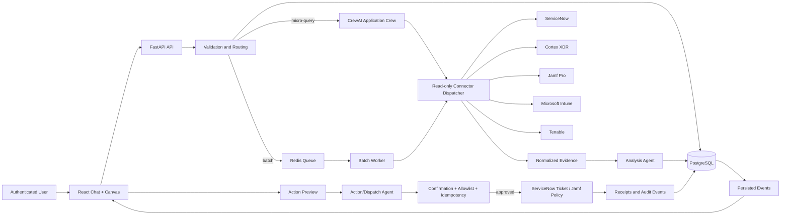

# Fleet Recon MVP Solution Architecture Document

## Context

This document translates the [Fleet Recon Product Requirements Document](prd.md) and [Market Requirements Document](mrd.md) into an implementable MVP architecture. Fleet Recon is the endpoint reconciliation workspace described by the PRD. The phrase "recruitment assistant" in the request is treated as a naming mismatch; the attached product requirements remain the engineering source of truth.

**Selected runtime:** `crewai`

**Primary language:** Python 3.11+

**MVP deployment shape:** one web application deployment, one worker deployment, one PostgreSQL database, and one Redis instance. This is intentionally small enough for a pilot while preserving durable state, asynchronous batch work, and real-time collaboration.

## 1. MVP Architecture Philosophy & Principles

### 1.1 Design Principles

1. **Evidence before inference.** Every finding references persisted source-evidence IDs, source record IDs, retrieval time, status, and correlation ID.
2. **Agents recommend; application services decide and enforce.** CrewAI agents produce validated structured outputs. Authorization, routing, target scope, confirmation, allowlists, version checks, and connector mutation boundaries are deterministic Python services.
3. **One server-side workspace state.** Chat cards, canvas rows, action previews, and activity history all read and mutate the same persisted entities.
4. **Deterministic routing.** Sanitization and deduplication happen before routing. The stored route never changes during a run.
5. **Partial failure is a result state.** A failed connector does not erase successful evidence from other connectors.
6. **Observable by default.** Every request, agent task, connector call, job, event, and action carries a correlation ID and structured status.
7. **Least privilege.** Read-only collection and analysis are separate from the two allowlisted mutation adapters. Secrets never enter agent context or browser responses.
8. **Reproducible agent execution.** Crew sessions are short-lived and task inputs are explicit. Persistent business state is in the database, not agent memory.

### 1.2 MVP Scope

**Included:**

- Copilot Chat and Live Canvas in a desktop-first web UI.
- Typed requests, pasted usernames, and CSV upload.
- Sanitization, deduplication, validation, and persisted micro-query/batch routing.
- Read-only evidence collection from ServiceNow, Cortex XDR, Jamf Pro, Microsoft Intune, and Tenable.
- Normalized evidence, findings, confidence, source citations, work items, notes, assignments, cleanup state, activity history, and filtered CSV export.
- Three CrewAI agents: Orchestrator, Analysis, and Action/Dispatch.
- Durable batch jobs with bounded connector concurrency and retry-safe collection.
- WebSocket collaboration events.
- Preview, explicit confirmation, allowlist enforcement, idempotency, and audit records for ServiceNow ticket creation and Jamf policy triggers.
- Basic authentication through an enterprise OIDC provider with Workspace User and Administrator roles; administrator claims gate configuration.
- Administrator Tool Management, workspace-scoped tool configuration, credential references, and connector health diagnostics.
- A governed compatibility path for the approved `asset_report_build.py`, `asset_report_mdm.py`, and `asset_report_app.py` capabilities.

**Explicitly deferred:**

- Autonomous remediation or automatic CMDB deletion/bidirectional synchronization.
- Additional mutation integrations beyond ServiceNow ticket creation and allowlisted Jamf policies.
- A full replacement console for any source platform.
- Multi-region active-active deployment, tenant self-service provisioning, advanced analytics, and long-term agent memory.
- Automatic identity merging when matching confidence is ambiguous.
- Malware scanning implementation when the enterprise upload service has not yet been selected; the upload boundary remains designed to support it.

### 1.3 Technical Architecture Decisions

| Concern | MVP decision | Rationale |
| --- | --- | --- |
| Frontend | React + TypeScript, Vite, accessible component primitives, CSS modules or scoped CSS | Supports a responsive split-pane application with typed API contracts and minimal runtime overhead. |
| Backend API | FastAPI with Pydantic models | Native async support for streaming, WebSockets, connector I/O, and clear schema validation. |
| Persistence | PostgreSQL | Required for durable query runs, evidence provenance, optimistic concurrency, notes, actions, and append-only audit events. |
| Batch queue | Redis-backed task queue, implemented with RQ or equivalent approved Python worker library | Keeps batch work out of request processes and is sufficient for a single-pilot deployment. |
| Eventing | FastAPI WebSocket endpoint backed by Redis pub/sub | Provides workspace-scoped live updates without introducing Kafka for MVP. Persist events before publication. |
| Agent runtime | CrewAI sequential process | Matches the three-role workflow and makes task context chaining explicit and inspectable. |
| Object storage | S3-compatible private bucket for immutable sanitized input CSVs and export files | Avoids putting batch payloads in queue messages and supports retention controls. |
| Connector HTTP | Async HTTP client with per-connector rate limiter and bounded retry policy | Isolates vendor APIs and makes partial completion measurable. |
| Model output | Structured Pydantic schemas and JSON-only task outputs | Prevents free-form recommendations from becoming executable operations. |
| Streaming | Server-sent events for chat/run progress; WebSockets for shared canvas events | SSE is simple for one-way chat progress; WebSockets support bidirectional collaboration updates. |
| Tool registry and configuration | PostgreSQL-backed approved tool definitions plus versioned workspace configurations; Pydantic/JSON Schema validation | Makes script capabilities discoverable and configurable without allowing arbitrary code or parameter injection. |
| Credential storage | Enterprise secret manager referenced by opaque `CredentialReference` records | Keeps API keys and passwords out of application data, agent context, logs, and browser responses. |
| Connector health | Read-only `validate_connection` checks with persisted health history and scheduled/on-demand execution | Gives Administrators actionable diagnostics while preventing health checks from becoming mutation or retry paths. |

## 2. Multi-Agent System Specification

### 2.1 Application Crew

The Application Crew is a small CrewAI crew owned by the backend orchestration layer. It is not exposed as an unrestricted autonomous loop. The API and domain services create a bounded crew execution with a specific `run_id`, workspace, permitted tools, and normalized context.

| Agent | Goal | Inputs | Outputs | Tools and hard boundary |
| --- | --- | --- | --- | --- |
| Orchestrator Agent | Classify intent, validate route metadata, coordinate the run, and prepare action requests when needed. | Sanitized request metadata, route, user intent, connector availability. | `OrchestratorResult`: status, route, progress messages, requested read operations, action-preview request. | Sanitizer, run store, read-only dispatcher, batch enqueuer, event publisher, action-request creator. Never calls a mutation adapter, reads secrets, or infers confirmation. |
| Analysis Agent | Compare normalized evidence and produce source-cited discrepancies and next-step playbooks. | Least-privilege normalized evidence references and policy catalog. | `AnalysisResult`: findings, category, severity, confidence, evidence IDs, recommendation, prerequisites, approval requirement. | Evidence reader, findings store, rule catalog. No connector mutation, ticket creation, Jamf policy trigger, or unsupported conclusion. |
| Action/Dispatch Agent | Construct and execute only an already-confirmed, allowlisted operation. | Selected work items, immutable action request, confirmation and allowlist results. | `DispatchResult`: per-target receipts, final action status, audit references. | Work-item reader, action store, confirmation verifier, allowlist verifier, schema validator, ServiceNow/Jamf adapter, audit writer. Cannot broaden target scope or execute without deterministic preconditions. |

The application service remains the authority around each agent. For example, an Action/Dispatch task can return a proposed operation, but a domain service must still verify that the persisted action request is unexpired, confirmed by the requester or an authorized user, unchanged, allowlisted, and idempotency-safe before calling a connector. Tool availability is similarly deterministic: a tool must be registered, enabled for the workspace, assigned to the agent, compatible with dependency health, and invoked with a validated configuration snapshot.

### 2.2 Tool Capability Model

The three supplied scripts are treated as approved capability adapters, not as unrestricted shell commands or user-uploaded code. The worker invokes a registered tool implementation through an internal Python interface and supplies an immutable `ToolExecutionContext` containing `workspace_id`, `run_id`, correlation ID, input object reference, effective tool/configuration/credential versions, and a cancellation signal. The adapter returns typed per-device evidence and safe telemetry; it does not write directly to a user-selected filesystem path or expose raw credentials.

| Capability | Source and behavior | Inputs and configuration | Typed output and architecture treatment |
| --- | --- | --- | --- |
| `asset_report_build` | Step 1. Resolves usernames through ServiceNow `sys_user`, fetches assigned `alm_hardware`, derives platform from model/manufacturer metadata, and emits one row per device or an explicit no-device/not-found row. | Sanitized username CSV; `states` allowlist such as `In use,In stock`; `platforms` allowlist such as `macOS,Windows`; batch size remains an implementation limit. | `DeviceInventoryEvidence` with username, serial, model, manufacturer, platform, state, substate, asset tag, and safe skip reason. ServiceNow calls use the ServiceNow connector and its configured credential reference. |
| `asset_report_mdm` | Step 2. Routes macOS rows to batched Jamf inventory (`GENERAL`, `HARDWARE`) and Windows rows to Intune serial lookup plus managed-device metadata. Preserves duplicate serial rows and marks not-found/lookup-error states explicitly. | Step 1 device evidence; `jamf_batch_size`, `intune_workers`, and max-age policy are bounded worker settings, not unrestricted user flags. | `MdmEvidence` with provider, managed/unmanaged/not-found status, last check-in, compliance, management agent, detail, source record reference, and safe error category. Jamf and Intune calls use separate connector credentials and rate limits. |
| `asset_report_app` | Step 3. For macOS, resolves an app-specific Jamf extension attribute first and falls back to Jamf application inventory; for Windows, queries Intune managed-app states. Classifies raw status as healthy/unhealthy/unknown and preserves provenance. | Step 1 device evidence; required `app` value; approved per-app signal-map rule; bounded Jamf batch size and Intune worker count. Signal-map rules are versioned configuration, not arbitrary executable logic. | `ApplicationEvidence` with app, raw status, health classification, source, versions/detail, and safe error category. EA ambiguity and fallback source are explicit evidence metadata. |

The scripts currently use CLI arguments, environment variables, `requests`, `pandas`, `PyYAML`, and a shared `fleet_common` module, and they print progress plus optional JSONL summaries. In the product, CLI parsing becomes schema-backed tool configuration; `fleet_common` behavior becomes shared connector/normalization services; progress becomes persisted run events; JSONL summaries become structured metrics; and CSV writes become database/object-store evidence persistence. A temporary worker adapter may preserve the scripts' sequential step ordering during migration, but each step must be independently retryable and checkpointed by `(run_id, subject/device, tool, configuration_version)`.

### 2.3 Script Pipeline and Execution Controls

For a batch run, the worker executes the capabilities as a dependency graph rather than one opaque process:

1. `asset_report_build` consumes the immutable sanitized input CSV and produces the canonical device set. Its ServiceNow state and platform filters are captured in the workspace configuration snapshot.
2. `asset_report_mdm` consumes only eligible device rows and fans out by platform. Jamf inventory remains batched (default 40, with a lower configured ceiling for API responses that reject larger requests); Intune remains per-device with a bounded concurrency limit (current script default 10).
3. `asset_report_app` consumes the same device set and an approved app configuration. It runs Jamf extension-attribute resolution before application-inventory fallback and uses Intune managed-app state priority `installed`, `failed`, `notApplicable`, `unknown`.
4. Normalization persists evidence after each successful subject/source operation. A step failure produces safe per-source error evidence and allows independent platform/source work to continue when dependency policy permits.
5. Analysis runs after the required evidence steps reach a terminal state, including partial completion. A run records step status, counts, API call telemetry, duration, and the exact tool/configuration versions.

The worker must not inherit arbitrary environment values from a user request. Connector sessions resolve credentials from the workspace's active opaque credential reference, and all HTTP calls use connector-owned timeouts, rate limits, bounded retries, and redacted exceptions. Report freshness warnings (`max_age_hours`) are represented as evidence/run warnings, not as a bypass of stale-data policy. Human-readable stdout from the legacy scripts is not an API contract.

### 2.4 CrewAI Configuration

The implementation must keep agent and task configuration in version-controlled YAML, with secrets and model credentials supplied through environment variables.

```yaml
# conceptual shape; exact CrewAI adapter syntax is finalized during setup
crew:
  process: sequential
  memory: false
  max_rpm: configured_per_environment
  agents:
    orchestrator:
      max_iter: 6
      allow_delegation: false
    analyst:
      max_iter: 5
      allow_delegation: false
    dispatcher:
      max_iter: 4
      allow_delegation: false
  tasks:
    - validate_and_route
    - analyze_evidence
    - preview_or_dispatch_confirmed_action
```

The YAML is configuration, not an authorization policy. Tool registration is performed in Python from explicit allowlists, and mutation tools are unavailable to the Orchestrator and Analysis agents.

### 2.5 Task and Turn Orchestration

#### Micro-query

1. FastAPI authenticates the user and creates a correlation ID.
2. `RequestIntakeService` sanitizes and deduplicates usernames, rejects invalid input, and persists `QueryRun` with `mode=micro_query`.
3. The Orchestrator task receives only validated metadata and determines targeted read operations.
4. Connector adapters run concurrently for the small subject set under connector-specific rate limits.
5. Each result is normalized and persisted as `SourceEvidence`; connector errors are persisted separately.
6. The Analysis task reads normalized evidence and persists findings/work items.
7. Run and card events are persisted and published to SSE/WebSocket subscribers.

#### Batch

1. Intake applies the same validation and deduplication rules.
2. For more than five unique usernames or any CSV upload, the service creates an immutable sanitized CSV object and persists its reference on `QueryRun`.
3. A deterministic job containing `run_id`, object reference, connector plan, and correlation ID is enqueued.
4. The worker reads the CSV, fans out bounded connector calls, checkpoints per-connector/per-subject results, and publishes progress.
5. The Analysis task runs after collection reaches a terminal state, including partial completion.
6. Findings and canvas work items are persisted; the run becomes `completed`, `partial`, `failed`, or `cancelled` according to explicit state rules.

#### Action flow

The canvas creates an `ActionRequest` preview from selected work items. The Action/Dispatch Agent may validate and summarize the preview, but execution is a separate command. The command performs schema validation, checks current work-item versions and exact target IDs, verifies confirmation expiration and allowlist policy, acquires the idempotency key, calls exactly one permitted connector operation, persists receipts, and emits audit events.

### 2.6 Context and Output Contracts

Agent context contains IDs and normalized fields only:

- `workspace_id`, `run_id`, `correlation_id`, actor ID, route, sanitized count, and intent metadata.
- Evidence references and normalized values approved by `redact_for_model`.
- No credentials, authorization headers, raw vendor responses, upload bytes, or unrestricted query strings.

All task outputs use Pydantic schemas. Invalid output is rejected, logged with a redacted validation error, and retried once with a correction instruction. A second failure marks the task failed and preserves the run's successful evidence.

### 2.7 Error Handling, Retry, Cancellation, and Budgets

- Connector retries use bounded exponential backoff, connector-specific rate limits, and only retry operations marked `retry_safe`.
- A single connector timeout or error creates source-specific error evidence and does not cancel other connectors.
- Batch jobs are idempotent by `(run_id, subject_id, source)` checkpoint. A retry creates no duplicate evidence or activity event.
- Cancellation is cooperative. The API marks a run cancellation requested; workers stop starting new subject calls and finish already committed records.
- Agent tasks have a 60-second micro-query analysis budget and a five-minute batch analysis budget, configurable per environment.
- A micro-query request targets a 10-second time-to-first-progress event and a 30-second normal completion budget, excluding vendor outages.
- CrewAI uses no persistent memory for MVP. Each task receives explicit context from the database and previous task output.
- Token and cost controls include bounded `max_iter`, structured prompts, least-privilege evidence, batch aggregation outside the model, and per-run model/token metrics.

## 3. Frontend Architecture Specification

### 3.1 Technology Stack

- React 18+ and TypeScript.
- Vite for the frontend build and local development server.
- Accessible, unopinionated component primitives with project-owned styling; no mandatory vendor UI dependency.
- React Query or an equivalent server-state library for query-run, canvas, and action-request data; local component state for draft text and unsaved note text.
- Native `EventSource` for run/chat SSE and a WebSocket client for workspace events.
- CSV upload through `multipart/form-data` with client-side size/type hints, while the server remains authoritative.

### 3.2 Application Structure

```text
frontend/src/
  app/                 # application shell, auth bootstrap, routing
  features/chat/       # message list, composer, upload, cards, confirmations
  features/canvas/     # filters, user/device tables, work-item detail
  features/activity/   # run and audit-safe activity views
  components/          # buttons, status, dialogs, live-region primitives
  api/                 # typed HTTP, SSE, and WebSocket clients
  types/               # API and domain contract types
```

The MVP has one authenticated workspace route, for example `/workspaces/:workspaceId`, with deep-linkable run and work-item selections. Configuration screens are hidden unless the authenticated identity carries the designated administrator claim.

Administrator Settings adds workspace-scoped `/workspaces/:workspaceId/settings/tools`, `/settings/credentials`, and `/settings/health` views. Tool rows show name, purpose, integration, version, lifecycle, effective enabled state, assigned agents, parameter summary, and last validation result. Tool configuration uses generated controls from the typed schema; it provides inline validation, a proposed diff, explicit save confirmation for scope changes, and a visible configuration version. Credential forms support create/rotate/deactivate and alias/status metadata, but render secret inputs only for new values. Health rows show the diagnostic state, checked-at time, credential version, latency, and redacted remediation text. Settings data is fetched only after the server authorizes the Administrator claim; hiding a route in the client is not an authorization control.

### 3.3 Interface Requirements

The desktop layout uses two independently scrollable panels: chat on the left and canvas on the right. At narrower widths the panels become tabbed views without losing server state. The canvas remains useful when chat is not open.

**Chat:**

- Text composer accepts natural-language requests and pasted usernames.
- A plus menu contains CSV upload and permitted action shortcuts; connector configuration is administrator-only.
- Messages show correlation ID, run status, progress, partial failures, evidence-cited result cards, and action confirmation prompts.
- Upload state shows validation, rejected-count summary, and server-created run ID without echoing sensitive raw content.

**Canvas:**

- Shared filters: run, owner, platform, connector state, finding category, compliance, assignee, and CMDB cleanup state.
- User table and device/evidence drill-down show source, retrieval time, confidence, errors, assignment, notes, checked state, and cleanup state.
- Action preview shows exact target count, operation, connector, rationale, expiration, and confirmation state.
- CSV export uses the current filter state and displays generation time and data-source timestamps.
- Activity stream shows safe state transitions and actor/time metadata, not secrets or raw responses.

**Loading, errors, and conflicts:**

- Use skeleton/progress states for initial data and run updates.
- Use status announcements for run progress, connector failures, and action results.
- Render partial completion as usable results plus source-specific errors.
- On HTTP 409 version conflicts, retain the local note draft and show the current server state with a resolve/retry action.
- Disable confirmation and mutation controls while a request is stale, expired, unauthorized, or missing required evidence.

Keyboard navigation, visible focus, semantic table headers, accessible labels, contrast-compliant status indicators, and a live region for progress are required for the core workflow.

## 4. Backend Architecture Specification

### 4.1 Service Boundaries

```text
backend/
  api/                 # FastAPI routers, auth dependencies, error handlers
  domain/              # routing, validation, concurrency, action policy
  agents/              # CrewAI crew, YAML config, structured task adapters
  tools/               # approved capability registry, schemas, adapters, and execution snapshots
  connectors/          # shared contract, five read adapters, two action adapters, and health checks
  jobs/                # queue definitions, batch worker, checkpoints
  persistence/         # SQLAlchemy models, repositories, migrations
  events/              # persisted events, Redis publisher, WebSocket manager
  security/            # OIDC validation, workspace and admin authorization
  observability/       # structured logging, metrics, trace correlation
```

### 4.2 API Contract

All API responses include `correlation_id`. Errors use:

```json
{
  "error": {
    "code": "VALIDATION_ERROR",
    "message": "No valid usernames were found.",
    "details": [{"field": "input", "reason": "empty_after_normalization"}]
  },
  "correlation_id": "uuid"
}
```

Representative endpoints:

| Method and path | Purpose |
| --- | --- |
| `POST /api/v1/workspaces/{workspace_id}/runs` | Submit typed/pasted input; returns `202` with `QueryRunSummary`. |
| `POST /api/v1/workspaces/{workspace_id}/runs/upload` | Validate CSV and create a batch run; returns `202` with immutable input reference metadata, never file contents. |
| `GET /api/v1/workspaces/{workspace_id}/runs/{run_id}` | Read run status and summary. |
| `GET /api/v1/workspaces/{workspace_id}/runs/{run_id}/events` | SSE stream for run progress and chat cards. |
| `GET /api/v1/workspaces/{workspace_id}/work-items` | Read filtered canvas work items. |
| `PATCH /api/v1/workspaces/{workspace_id}/work-items/{id}` | Update checked, assignee, cleanup state, or note-related state with `expected_version`. |
| `POST /api/v1/workspaces/{workspace_id}/work-items/{id}/notes` | Add a revisioned note with `expected_version`. |
| `POST /api/v1/workspaces/{workspace_id}/action-requests` | Create an exact-scope action preview. |
| `POST /api/v1/workspaces/{workspace_id}/action-requests/{id}/confirm` | Confirm an unexpired preview without changing its scope. |
| `POST /api/v1/workspaces/{workspace_id}/action-requests/{id}/cancel` | Cancel a pending action. |
| `POST /api/v1/workspaces/{workspace_id}/action-requests/{id}/execute` | Execute after deterministic confirmation and allowlist checks. |
| `GET /api/v1/workspaces/{workspace_id}/export` | Generate a filtered CSV export with policy checks. |
| `GET /api/v1/workspaces/{workspace_id}/events` | WebSocket connection for persisted workspace updates. |
| `GET /api/v1/workspaces/{workspace_id}/admin/tools` | Administrator-only catalog with effective workspace configuration and schemas. |
| `PATCH /api/v1/workspaces/{workspace_id}/admin/tools/{tool_id}` | Administrator-only enable/disable, agent assignment, or validated parameter configuration; returns a new configuration version. |
| `GET /api/v1/workspaces/{workspace_id}/admin/credentials` | Administrator-only integration aliases, lifecycle metadata, and current health summary; never secret values. |
| `PUT /api/v1/workspaces/{workspace_id}/admin/credentials/{integration}` | Administrator-only create/rotate/deactivate credential through the secret manager using optimistic concurrency. |
| `POST /api/v1/workspaces/{workspace_id}/admin/health/{integration}/test` | Administrator-only read-only connection test for the active or specified pending credential version. |
| `GET /api/v1/workspaces/{workspace_id}/admin/health` | Administrator-only current health rows and safe diagnostic history. |
| `GET /api/v1/health` | Liveness; does not expose connector secrets or payloads. |
| `GET /api/v1/ready` | Readiness for database, Redis, and worker dependencies. |

`POST /runs` request shape:

```json
{
  "input_kind": "typed|pasted",
  "text": "alice@example.com\nbob@example.com",
  "intent": "optional normalized intent metadata"
}
```

`QueryRunSummary` includes `id`, `workspace_id`, `input_kind`, `input_count`, `mode`, `status`, `correlation_id`, timestamps, and rejected-count metadata. It does not include raw rejected input.

SSE event envelope:

```json
{
  "event_id": "uuid",
  "event_type": "run.progress|chat.card|connector.error|run.completed",
  "workspace_id": "uuid",
  "run_id": "uuid",
  "sequence": 12,
  "occurred_at": "timestamp",
  "correlation_id": "uuid",
  "data": {}
}
```

WebSocket events use the same envelope and are authorized to one workspace. Clients reconcile by `sequence` and refetch on a gap.

### 4.3 Validation, Rate Limiting, and Authorization

- Pydantic validates all request bodies, query parameters, CSV metadata, action parameters, and agent outputs.
- Input normalization trims whitespace, removes unsupported control characters, normalizes line endings, validates the configured username format, deduplicates case-insensitively, and records only safe rejection reasons.
- CSV validation enforces configurable maximum bytes and rows, UTF-8 with explicit handling for approved encodings, required username column mapping, allowed MIME/type policy, and an upload malware-scan hook when required by the enterprise service.
- API rate limits apply per authenticated actor and workspace; run creation, upload, export, and action execution have separate limits.
- Every workspace query includes workspace authorization. Administrator-only configuration checks an explicit identity claim and never relies on a frontend-only guard.
- Tool execution authorization evaluates tool registry state, workspace enablement, agent assignment, actor role, dependency health policy, and validated parameters in one server-side policy service. Admin endpoints use deny-by-default authorization and optimistic version checks.
- Mutations require authenticated actor, workspace, correlation ID, entity version where applicable, and server timestamp.

### 4.4 Data Architecture

PostgreSQL is required because the PRD explicitly requires durable shared state, immutable run metadata, source provenance, optimistic concurrency, revisioned notes, durable actions, and append-only audit events.

Core tables map directly to the PRD entities:

- `workspace`
- `query_run` and `query_run_input`
- `subject`, `device`, and `device_source_identity`
- `source_evidence` and `connector_error`
- `finding` and `finding_evidence`
- `canvas_work_item`
- `note` and `note_revision`
- `action_request` and `action_receipt`
- `audit_event`
- `workspace_membership`, `connector_config_metadata`, and `action_allowlist`
- `tool_definition`, `workspace_tool_config`, `tool_execution_snapshot`, `credential_reference`, and `connection_health_check`

Sensitive or large values are references, not inline application data: raw connector responses remain in an approved retention store or vendor reference, and sanitized input CSVs are stored in a private bucket. The normalized JSON supplied to the Analysis Agent is stored with a schema version and redaction policy version.

`canvas_work_item.version` and `note.version` are incremented in the same transaction as their mutation. An update with a stale `expected_version` returns `409 CONFLICT` and includes the current safe representation.

`workspace_tool_config.version` and `credential_reference.version` are incremented transactionally with their audit event. A `tool_execution_snapshot` is created when a run starts and contains effective tool versions, parameter values after secret-marker redaction, workspace configuration versions, credential versions, and dependency health decisions. The snapshot contains references, never secret material. Tool registry entries are immutable by version; retiring a version prevents new runs while preserving historical reconstruction.

### 4.5 Runtime Integration Layer

FastAPI invokes the CrewAI application service with a typed `CrewContext`. The service selects the crew task sequence based on the persisted route and passes only permitted tool instances. The worker uses the same service layer as the API so micro-query and batch behavior share routing, normalization, persistence, and event rules.

Connector adapters implement this contract:

```python
class Connector(Protocol):
    async def validate_connection(self) -> ConnectionStatus: ...
    async def fetch_by_identity(self, identity: CanonicalIdentity) -> list[RawRecord]: ...
    def normalize(self, record: RawRecord) -> NormalizedEvidence: ...
    def rate_limit(self) -> RateLimit: ...
    def retry_safe(self, operation: str) -> bool: ...
    def redact_for_model(self, evidence: NormalizedEvidence) -> ModelEvidence: ...
```

The five read adapters are ServiceNow, Cortex XDR, Jamf Pro, Microsoft Intune, and Tenable. The two write adapters are allowlisted ServiceNow ticket creation and Jamf policy trigger. Write adapters are never registered in read or analysis tool sets.

The legacy report scripts are adapted behind this contract rather than imported into request handlers. `asset_report_build` uses the ServiceNow adapter's user and hardware operations; `asset_report_mdm` uses Jamf inventory and Intune managed-device operations; and `asset_report_app` uses Jamf extension-attribute/application inventory and Intune managed-app operations. Each adapter emits typed evidence and safe error categories. The worker may execute the existing scripts in a compatibility mode during migration only when it controls the input/output object references, environment, timeout, and process identity; arbitrary command, path, or environment injection from chat is prohibited.

Prompt and task traces record crew name, task name, model identifier, token counts, duration, validation result, and correlation ID. They exclude prompts containing secrets, raw payloads, upload data, and unredacted endpoint identifiers beyond approved policy.

### 4.6 Authentication and Secrets

Use enterprise OIDC for browser authentication and short-lived access tokens for the API. The MVP maps an authenticated user to Workspace User or Administrator; an administrator claim gates tool registry/configuration views, connector credential metadata, health diagnostics, and action-allowlist configuration. Secret-manager access is performed by the backend worker/API using a service identity scoped to the target workspace and integration; CrewAI agents receive connector handles, not secret values.

Environment variable names are defined in `.env.example` during setup, including:

- `DATABASE_URL`
- `REDIS_URL`
- `OBJECT_STORAGE_ENDPOINT`
- `OBJECT_STORAGE_BUCKET`
- `OBJECT_STORAGE_ACCESS_KEY_ID`
- `OBJECT_STORAGE_SECRET_ACCESS_KEY`
- `OIDC_ISSUER_URL`
- `OIDC_CLIENT_ID`
- `OIDC_CLIENT_SECRET`
- `CREWAI_MODEL_NAME`
- `CREWAI_MODEL_API_KEY`
- `SERVICENOW_BASE_URL`, `SERVICENOW_CLIENT_ID`, `SERVICENOW_CLIENT_SECRET`
- `CORTEX_XDR_BASE_URL`, `CORTEX_XDR_CLIENT_ID`, `CORTEX_XDR_CLIENT_SECRET`
- `JAMF_BASE_URL`, `JAMF_CLIENT_ID`, `JAMF_CLIENT_SECRET`
- `INTUNE_TENANT_ID`, `INTUNE_CLIENT_ID`, `INTUNE_CLIENT_SECRET`
- `TENABLE_BASE_URL`, `TENABLE_ACCESS_KEY`, `TENABLE_SECRET_KEY`

No values are committed to source, SAD artifacts, prompts, logs, fixtures, or exports.

## 5. DevOps & Deployment Architecture

### 5.1 MVP Runtime

A containerized deployment contains:

1. `web-api`: FastAPI, SSE/WebSocket endpoints, synchronous micro-query coordination, and health endpoints.
2. `batch-worker`: Redis queue consumer, connector collection, analysis execution, and progress publication.
3. `frontend`: static React assets served by the web tier or a small static hosting service.
4. Managed PostgreSQL, Redis, and private object storage.

A single-region managed container platform is sufficient for the pilot. The worker can scale independently from the API when queue depth grows.

### 5.2 CI/CD

The pipeline must run on every change:

- Formatting and linting (`ruff`, `mypy`, frontend formatter/linter).
- Unit tests and connector contract tests.
- API/integration tests with PostgreSQL, Redis, and connector fixtures.
- Frontend build and accessibility smoke checks.
- Dependency vulnerability audit and secret scan.
- Container build and migration validation.

Deployment promotes the same immutable image through environments. Database migrations are forward-only and run as a controlled release step. Connector credentials are injected by the deployment secret manager.

### 5.3 Observability

Structured JSON logs include `correlation_id`, `workspace_id`, `run_id`, actor ID where policy permits, component, operation, status, duration, and error code. Metrics include:

- Request counts and validation rejection counts.
- Micro-query/batch route counts and route correctness.
- Queue depth, job age, retries, cancellations, and terminal statuses.
- Connector latency, rate-limit waits, error counts, and partial-run counts.
- Agent duration, token usage, schema failures, and cost estimates.
- WebSocket/SSE subscriber count and event delivery latency.
- Action previews, confirmations, executions, failures, and idempotency conflicts.

Health endpoints expose dependency status only as coarse healthy/unhealthy information. Advanced tracing, APM, multi-region failover, and customer-facing analytics are future work.

## 6. Data Flow & Integration Architecture



### 6.1 Collection and Normalization

Each connector receives a canonical identity and correlation ID. It returns source-specific records that are immediately normalized into the common evidence schema. The persistence transaction records source, source record ID, retrieval time, status, schema version, redaction policy version, and a raw-retention reference. Errors are stored with a safe category and retryability flag.

Identity matching is explicit. A high-confidence match may link a source record to a device; an ambiguous match produces `insufficient_evidence` or a review state rather than silently merging devices.

### 6.2 Collaboration Event Path

A canvas mutation is authorized, version-checked, committed with an audit event, and then published to Redis. WebSocket managers subscribe by workspace and broadcast the safe event within the five-second PRD target. A reconnecting client refetches current state and uses event sequence numbers to detect gaps.

### 6.3 Action Path

Only selected work-item IDs are accepted. The server snapshots target IDs, operation, parameters, evidence rationale, requester, blast-radius count, expiration, and idempotency key in `ActionRequest`. Confirmation signs that exact snapshot. Execution refuses any changed target or parameter set, verifies the allowlist, and writes a receipt for every target.

## 7. Performance & Scalability Specifications

### 7.1 MVP Targets

- First micro-query progress event: within 10 seconds under healthy connector conditions.
- Normal micro-query completion: within 30 seconds for up to five users, excluding vendor outage time.
- Batch acceptance response: within 2 seconds after successful validation and object persistence.
- Batch progress: at least one persisted progress event per connector milestone or every 10 seconds for active work.
- Canvas mutation broadcast: 99.9% delivered to connected collaborators within five seconds.
- Export request acknowledgement: within two seconds; large exports may complete asynchronously.
- Initial pilot capacity: 25 concurrent active users, 5 concurrent micro-queries, and 2 concurrent batch jobs, configurable by environment.

### 7.2 Scaling Path

The API and worker are stateless apart from managed stores and can scale independently. Redis queue depth determines worker replicas; connector rate limits remain global per credential. PostgreSQL indexes cover workspace/run/device/status/filter columns, and evidence payloads are kept out of hot list queries.

Horizontal event infrastructure, partitioned evidence storage, read replicas, and multi-region deployment are deferred until pilot measurements justify them. The MVP avoids premature distributed systems while retaining clear boundaries for those upgrades.

## 8. Security & Compliance Architecture

### 8.1 Threat and Control Summary

| Threat | MVP control |
| --- | --- |
| Cross-workspace data access | Workspace-scoped authorization on every repository query and event subscription; integration tests for tenant/workspace isolation. |
| Secret exposure to agents or clients | Secret manager injection, tool scoping, redaction, log filters, and no raw connector payload in browser responses. |
| Unauthorized mutation | Separate write adapters, administrator allowlist, exact-scope action request, explicit confirmation, expiration, and idempotency. |
| Input injection or unsafe CSV | Pydantic validation, control-character stripping, size/row/type checks, encoding policy, malware-scan hook, and safe output escaping. |
| Stale overwrite | Transactional optimistic version checks and `409 CONFLICT` responses. |
| LLM hallucination or prompt injection from source data | `redact_for_model`, least-privilege normalized JSON, structured outputs, evidence citation requirement, and no model authority over policy checks. |
| Sensitive export leakage | Authorization, active-filter policy evaluation, safe fields only, export audit event, private object storage, and retention policy. |

Tool execution authorization evaluates tool registry state, workspace enablement, agent assignment, actor role, dependency health policy, and validated parameters in one server-side policy service. Admin endpoints use deny-by-default authorization and optimistic version checks.

All traffic uses TLS. Database, Redis, and object storage use encryption at rest supplied by the hosting platform. Connector credentials use least-privilege scopes and are rotated outside the application. Audit events are append-only at the application boundary and protected from ordinary User edits.

### 8.2 Authentication and Authorization

The identity provider is OIDC. The API validates issuer, audience, signature, expiry, and workspace membership. The MVP maps an authenticated user to Workspace User or Administrator; an administrator claim gates tool registry/configuration views, connector credential metadata, health diagnostics, and action-allowlist configuration. Secret-manager access is performed by the backend worker/API using a service identity scoped to the target workspace and integration; CrewAI agents receive connector handles, not secret values.

### 8.3 Compliance and Retention

Data residency, audit retention duration, endpoint identifier classification, vendor-specific API terms, and enterprise upload malware scanning are open decisions. Until resolved, default to the shortest operational retention compatible with the pilot, private storage, redacted telemetry, and documented deletion procedures. A security assessment is required before production delivery.

## 9. Testing & Quality Assurance Specifications

### 9.1 Unit Tests

- Username sanitization, control-character removal, normalization, deduplication, and safe rejection reporting.
- Routing threshold: five unique users without CSV is micro-query; six is batch; every CSV is batch; invalid input is rejected without connector calls.
- CSV size, row, MIME/type, encoding, required-column, and upload-scan-hook behavior.
- Connector normalization and redaction for each adapter.
- `asset_report_build` username-column detection, normalization, ServiceNow state/platform filtering, one-row-per-device behavior, placeholder serial handling, and explicit no-device/not-found output.
- `asset_report_mdm` duplicate-serial preservation, Jamf batch-size behavior, platform dispatch, Intune bounded concurrency, last-check-in mapping, and partial lookup errors.
- `asset_report_app` extension-attribute precedence, ambiguity/fallback behavior, per-app signal-map classification, Intune state priority, and source provenance.
- Partial-failure aggregation and retry-safe checkpointing.
- Tool registry enablement/assignment/parameter authorization, immutable execution snapshots, credential rotation redaction, and connection-health state mapping.
- CrewAI structured output validation and prohibited-tool registration.
- Action confirmation, expiration, allowlist, exact scope, idempotency, and low-confidence gating.
- Optimistic concurrency and note revision behavior.
- Filtered CSV export policy and timestamp fields.

### 9.2 Integration Tests

Use vendor sandbox or deterministic fixtures to verify the shared connector contract for ServiceNow, Cortex XDR, Jamf Pro, Intune, and Tenable. Exercise PostgreSQL transactions, Redis queue/retry behavior, SSE/WebSocket event delivery, workspace isolation, and the full confirmed ServiceNow/Jamf action path.

### 9.3 Smoke and Acceptance Tests

1. Five valid unique usernames route to micro-query and six route to batch after normalization.
2. A small CSV routes to batch and leaves an immutable sanitized input reference.
3. One connector failure leaves successful source evidence visible and marks the run partial.
4. Two authenticated clients observe a check-state or assignment update within five seconds.
5. A stale work-item version receives `409` and cannot overwrite current state.
6. Findings cite evidence IDs and classify insufficient evidence.
7. An unconfirmed, expired, changed-scope, or unallowlisted action never reaches a write connector.
8. A confirmed action produces per-target receipts and append-only audit events.
9. An export respects active filters and includes generation and source timestamps.
10. The three report capabilities execute in order against deterministic fixtures, persist typed evidence after each step, preserve explicit skip/error states, and do not write secrets or arbitrary paths.
11. Workspace Users are denied all administrator tool, credential, and health APIs; Administrators can update configuration and observe redacted health results.
12. A credential rotation and tool-configuration change affect new runs only, while an active run continues using its persisted execution snapshot.

### 9.4 Runtime-Specific Quality Gates

- Crew composition contains no more than three MVP agents and uses sequential task chaining.
- Agent tools are asserted in tests by role; mutation tools are absent from Orchestrator and Analysis.
- Every crew task returns a schema-valid Pydantic object or a controlled failure.
- Prompt traces include correlation and task metadata without secrets or unredacted payloads.
- `aamad validate` passes before the Build phase is accepted.
- Security review, dependency audit, and secret scan pass before Deliver.

## 10. MVP Launch & Feedback Strategy

### 10.1 Pilot Criteria

Begin with one design-partner workflow and non-production or tightly scoped production connector credentials. The pilot must have a named administrator, an allowlist of initial ServiceNow fields and Jamf policies, a baseline reconciliation process, and an approved data-retention policy.

Launch readiness requires:

- End-to-end completion of one recurring reconciliation workflow.
- Source provenance visible for every conclusion and partial failure.
- Complete approval, scope, idempotency, receipt, and audit chain for every tested mutation.
- No critical cross-workspace, secret-exposure, or confirmation-bypass finding.
- Operational runbook for connector outage, queue backlog, action cancellation, and credential rotation.

### 10.2 Success Metrics

Measure the PRD/MRD outcomes:

- 100% route correctness for accepted requests.
- 100% approval coverage for state-changing calls.
- 99.9% of accepted canvas mutations visible within five seconds.
- Baseline and trend for investigation time, CMDB discrepancy aging, closure rate, evidence coverage, and partial connector failures.
- Model tokens and connector calls per run by route.
- At least 80% of pilot users rating evidence and next actions useful, as specified by the MRD.

### 10.3 Post-Pilot Priorities

Prioritize based on observed evidence: source precedence and freshness policy, connector health UX, bulk-target limits, export governance, additional identity matching safeguards, and measured queue/event scaling. Keep autonomous mutation and broad connector expansion out of scope until approval and evidence quality are demonstrated.

## Implementation Guidance for AI Development Agents

1. Create the Python/FastAPI/React project skeleton, dependency policy, `.env.example`, migrations, and local service composition.
2. Implement canonical schemas, request sanitization, deterministic routing, and unit tests before connector breadth.
3. Implement PostgreSQL repositories, Redis jobs, event envelopes, and optimistic concurrency.
4. Build the frontend Chat and Canvas against typed mock API contracts before backend integration.
5. Implement read-only connector contracts with fixtures and partial-failure behavior.
6. Add CrewAI YAML configuration, role-scoped tools, structured outputs, and prompt trace hooks.
7. Integrate the frontend with API/SSE/WebSocket paths and verify collaboration behavior.
8. Add ActionRequest preview, confirmation, allowlist, idempotency, and only then the ServiceNow/Jamf write adapters.
9. Run QA acceptance tests, security assessment, dependency audit, and `aamad validate` before delivery packaging.

## Architecture Validation Checklist

- [x] PRD requirements mapped to architectural components.
- [x] Three agents defined with least-privilege boundaries.
- [x] Frontend and backend contracts define compatible run, event, work-item, and action shapes.
- [x] Secrets are represented only as environment-variable names.
- [x] MVP and Future Work boundaries are explicit.
- [x] `AAMAD_TARGET_RUNTIME=crewai` is resolved and recorded in Audit.
- [x] Durable persistence, queueing, real-time events, optimistic concurrency, and confirmation-gated actions are addressed.

## Sources

- [Fleet Recon PRD](prd.md).
- [Fleet Recon MRD](mrd.md).
- [AAMAD configuration](../../aamad.config.yml).
- [AAMAD SAD template](../../.cursor/templates/sad-template.md).
- [AAMAD agent framework overview](../../AGENTS.md).
- Reviewed capability sources: `/Users/nick.sanchez/work-archived-2026-08-27/scripts/asset_report_build.py`, `/Users/nick.sanchez/work-archived-2026-08-27/scripts/asset_report_mdm.py`, and `/Users/nick.sanchez/work-archived-2026-08-27/scripts/asset_report_app.py`.

## Assumptions

- The attached PRD is authoritative for the product domain, despite the request referring to a recruitment assistant.
- CrewAI is used as an orchestration runtime, not as a security or authorization boundary.
- PostgreSQL, Redis, and private object storage are available as managed or containerized pilot dependencies.
- The enterprise provides an OIDC identity provider and approved non-production connector credentials.
- The three supplied report scripts are approved starting implementations; their current CLI/CSV behavior is compatibility input to the typed tool adapters, not a permanent public API.
- Vendor API permissions and exact field mappings are finalized during the Build integration phase.
- A single workspace can contain multiple authenticated collaborators, while the MVP remains single-tenant per deployment.

## Open Questions

1. Which browser versions, identity provider, data residency region, and concurrent-user target must the pilot support?
2. Which source wins when identity, platform, ownership, or lifecycle evidence conflicts, and what freshness windows apply?
3. Which actions are classified as heavy MDM scans, what target limit applies, and which Jamf policies are initially allowlisted?
4. Which ServiceNow ticket type, fields, assignment rules, and approval workflow are required for the pilot?
5. What retention and deletion periods apply to normalized evidence, raw-response references, input CSVs, exports, and audit events?
6. Which enterprise upload service provides malware scanning, and is it mandatory for the pilot?
7. Which model provider, region, data-processing agreement, and token budget are approved for CrewAI?
8. Are Cortex XDR and Tenable permissions available through an internal integration platform or must direct adapters be built?

## Audit

- 2026-08-27 | `system-arch` | `create-sad` | Resolved `AAMAD_TARGET_RUNTIME=crewai` from `aamad.config.yml`; created the MVP Solution Architecture Document from the Fleet Recon PRD, MRD, and SAD template.
- 2026-08-27 | `system-arch` | `update-sad` | Incorporated updated PRD administrator requirements and reviewed the three report scripts; defined governed capability adapters, pipeline execution, configuration/credential APIs, health diagnostics, RBAC enforcement, and versioned run snapshots.
